## 一、微博第三方登录

- 微博开放平台

  微博开放平台封装了可直接部署在任意网站上的微博登录按钮、关注按钮、分享按钮等组件，为开发者降低新用户注册门槛的同时，实现了社交关系的零成本引入和优质内容的快速传播

- 微博开放平台地址

  http://open.weibo.com 

  

## 二、开发者平台配置流程

1. 首先要在微博开发着平台去注册成为开发者。一般只要拥有微博账号就可以成为开发者，两者账号是共通的。网页链接为：https://open.weibo.com/?sudaref=passport.weibo.com#_loginLayer_1625191272792, 在此页进行登陆。

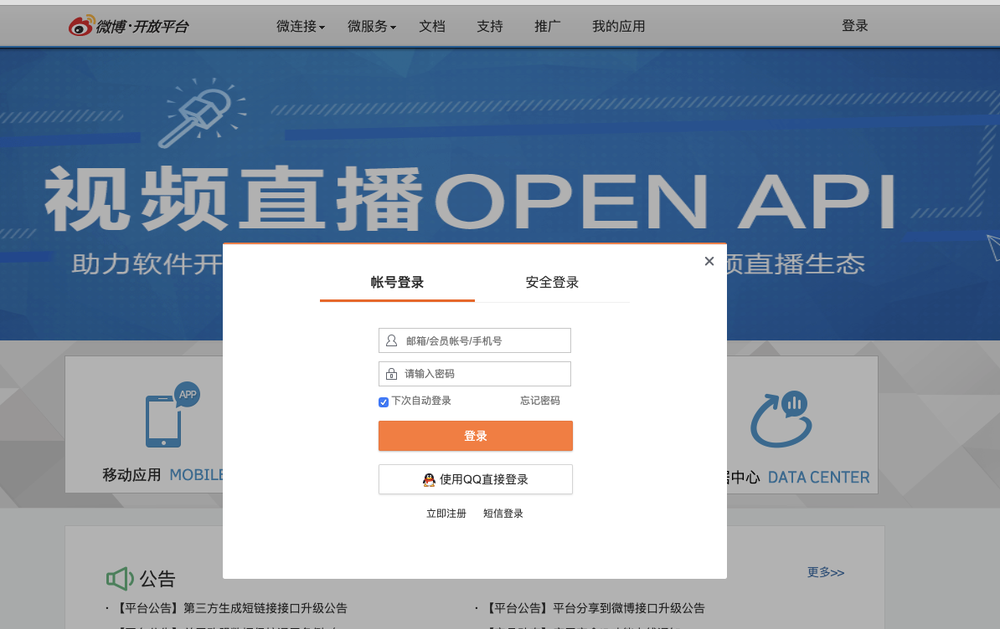


2. 登陆之后可以，可以在本页面中看到相关微博登陆实现路线。https://open.weibo.com/authentication

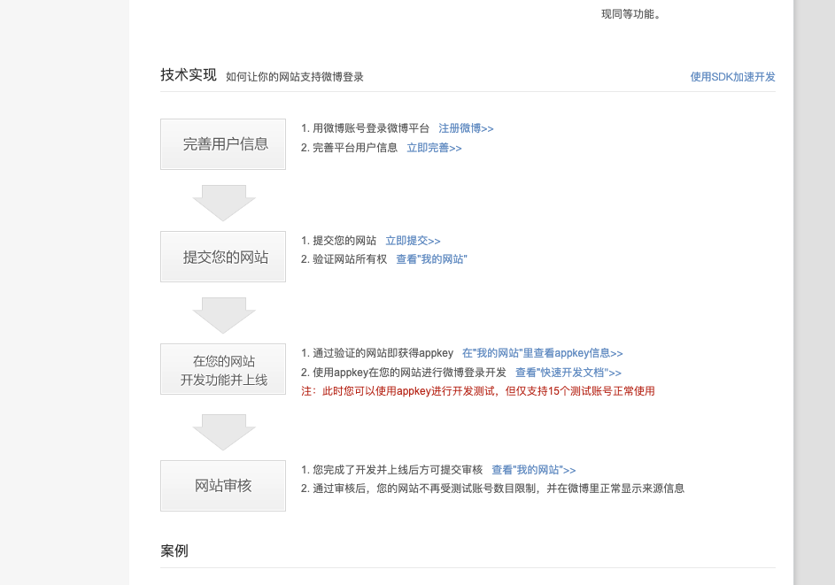

3. 此时我们去要先去完善个人信息。完善个人信息网址如下（在此需要注意的是我们个人开发这就直接去选择个人就可以了）：https://open.weibo.com/developers/basicinfo

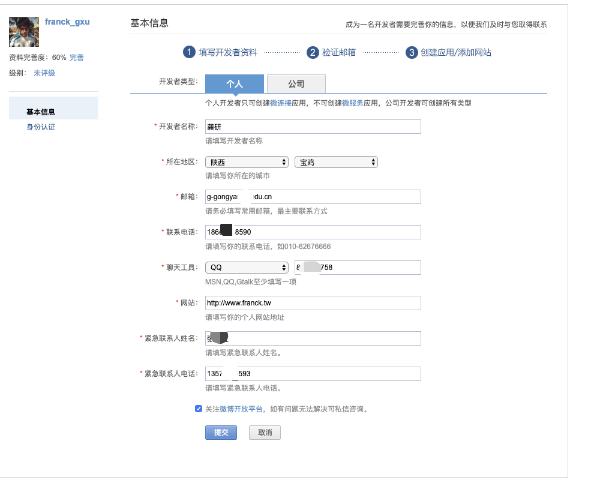

4. 创建个人网站，在此网页中输入你自定义的应用名称，此应用名称也就是用户通过微博授权登陆时，提示的哪个网站将会获取个人信息：https://open.weibo.com/apps/new?sort=web

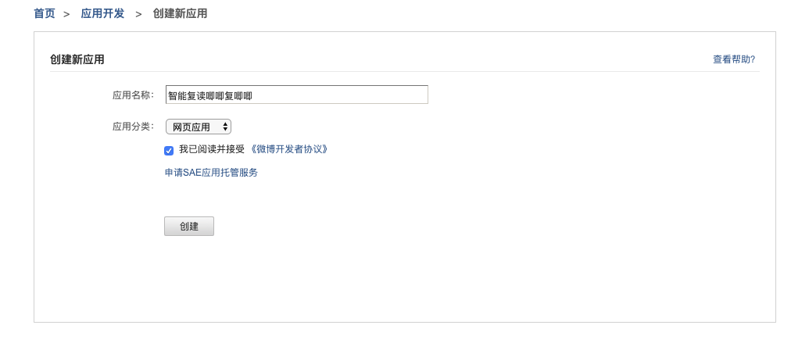

5. 创建之后跳转到个人应用的网页，此网页中会有一些相关信息，例如：应用的key、应用的secret.这两条信息至关重要。应当保存好，可以根据当前页面中的提示进行补充完善个人信息。

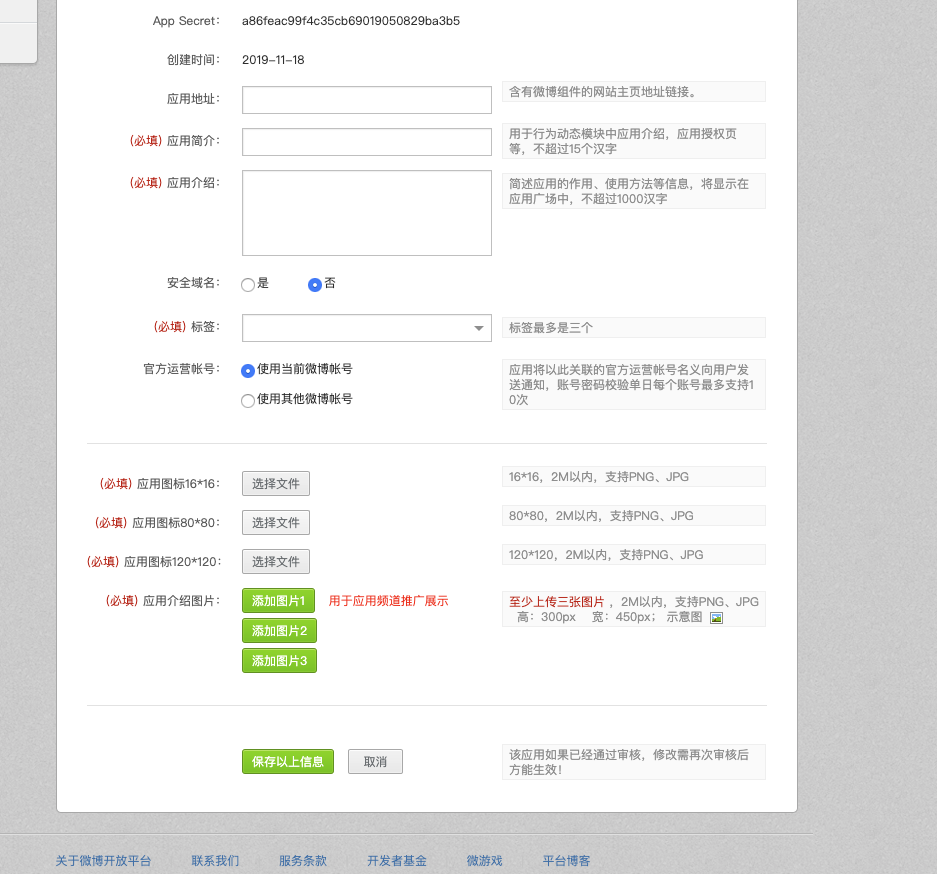

6. 设置回调地址：此时的回调地址就是微博授权登陆成功之后，前端重定向的地址。在此处设置相关的回调地址：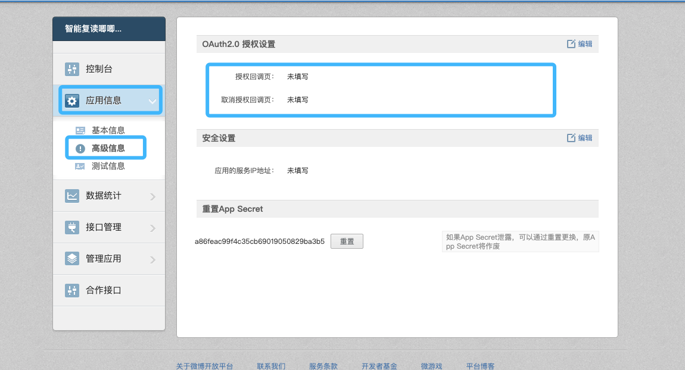

7. 微博登陆时序图。

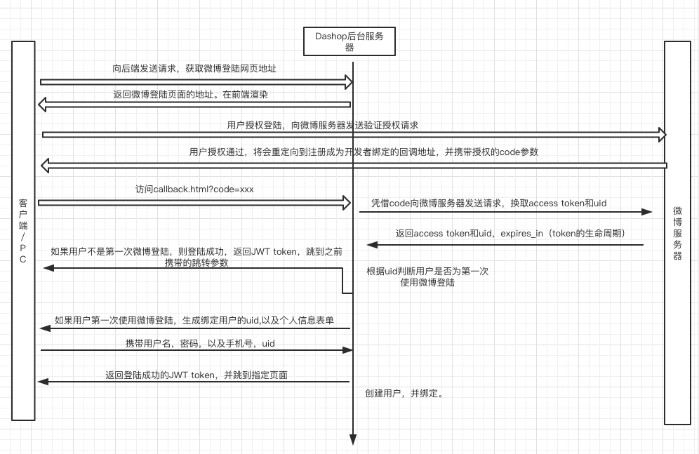


## 三、微博登录实现流程

### 1. 获取微博登陆页及用户授权码

​	我们可以先将一些关键参数配置到settings中。

```python
# 微博第三方登陆的配置信息
# 微博开发者平台注册应用ID
WEIBO_CLIENT_ID = '2987431629'
# 微博开发者平台注册的应用的密钥
WEIBO_CLIENT_SECRET = 'fe3c4fe60da7f2de3413522c1551b7d2'
# 需要在高级应用中配置的正常请求之后的回调地址 回调地址可以自己设置，具体根据回调页面设置
REDIRECT_URI = 'http://127.0.0.1:8080/templates/web/callback.html'
```

​	获取微博登陆页URL的API：

```python
http://127.0.0.1:8000/v1/users/weibo/authorization
```

请求方式：**GET**

**返回值**：JSON

**响应格式**：

```python
{
  'oauth_url': oauth_weibo_url # 微博登陆页URL，重定向到此页
}
```

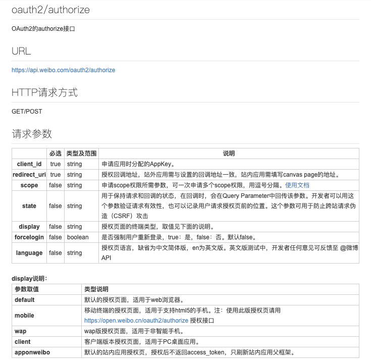

后端实现：

```python

# 获取微博登陆页
class OAuthWeiboUrlView(View):
    def get(self, request):
        """
        用来获取微博第三方登陆的url
        :param request:
        :param username:
        :return:
        """
        try:
            oauth_weibo = OAuthWeibo()
            oauth_weibo_url = oauth_weibo.get_weibo_login_url()
        except Exception as e:
            return JsonResponse({'code': 10124, 'error': 'Cant get weibo login page'})
        return JsonResponse({'code': 200, 'oauth_url': oauth_weibo_url})
```

前端页面收到重定向的第三方登录，登陆成功之后会携带我们在注册的时候的填写回调地址的网页。


**<font color=red>scope说明</font>**

Scope 相关网页地址为：https://open.weibo.com/wiki/Oauth2/authorize

scope是OAuth2.0授权机制中authorize接口的一个参数。通过scope，平台将开放更多的微博核心功能给开发者，同时也加强用户隐私保护，提升了用户体验，用户在新OAuth2.0授权页中有权利选择赋予应用的功能。

关于scope的解释文档如下，假如我们需要使用更多的微博用户相关的信息，我们可以添加scope这个参数，**scope参数并不是必须的，我们可以通过设置scope的值来获取相关权限**

开发者需要先在应用控制台的接口管理中申请到相关的接口，才能使用scope功能，如果没有接口权限，调用时候会遇到10014错误。相关申请页面如下(在此页面中可以查看已有权限)：

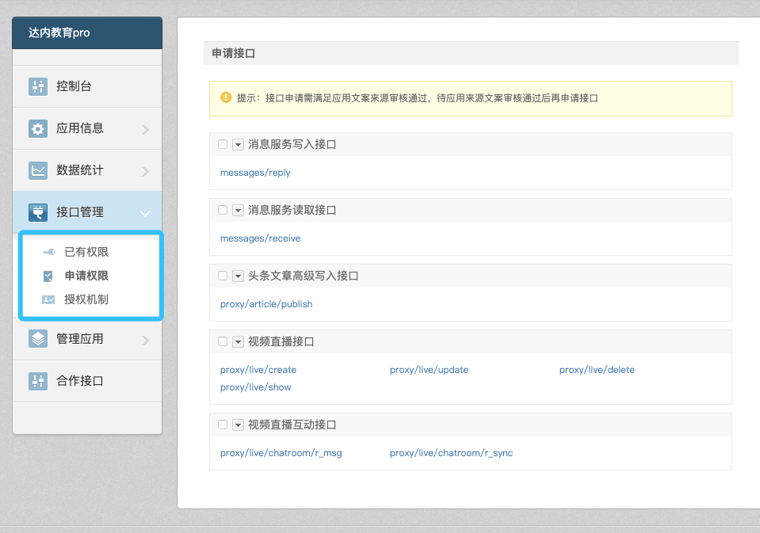

满足上一条后，开发者向用户请求scope权限，就会出现高级授权页面(如下图)，当用户允许后就能正常使用接口，反之会遇到10032错误。


**<font color=red>redirect_uri说明</font>**

我们自己在后端设置的地址，和微博开发者平台上的地址必须一致，主要是为了防止返回地址被篡改为其他网站。


### 2. 获取用户token

Oauth_weibo_url示例:

Ouath_url 是后端给我们返回的重定向的地址。此地址会在前端冲定向到我们的授权登陆页。用户可以在此页上进行登陆授权。

```python
https://api.weibo.com/oauth2/authorize?response_type=code&client_id=4135484183&redirect_uri=http%3A%2F%2Fwww.dadashop.com%3A8080%2Foauth_callback.html&scope=
```

登陆授权之后会返回我们之前设置的回调地址。也就是上面链接中的。**redirect_uri**是我们在settings中配置的一项。

授权登陆成功之后会回调到我们的前端的地址。地址如下：

```python
# 此处的地址为前端地址
#http://127.0.0.1:8080/callback.html?state=%2F&code=ef0362d563853d93a9b9be95381a165a
```

此链接中的code是个临时码，此code生成的临时的用来获取**access_token**和**uid**.

 access_token:此关键参数可以根据我们自己应用的权限来获取用户的其他相关信息，具体的使用方式可以查看相关的scope中获取的权限。

 uid:微博的用户ID，此值是唯一的。

​	当用户页面重定向到上面的网址时候，js获取到code码，继续向后端发送请求，获取access_token以及获取用户的uid。查询是否绑定的了达达商城的用户，如果绑定返回jwt token,如果没有绑定，返回重定向的页面绑定新用户，然后再返回jwt token.

后端的接口如下：

```python
http://127.0.0.1:8000/v1/user/weibo/users
```

请求方式：**GET**

请求参数：

| 参数 | 参数类型 | 备注 | 含义                     |
| ---- | -------- | ---- | ------------------------ |
| code | char     | 必填 | 用户登陆之后获得的授权码 |

后端的收到GET请求获取到前端传递过来的code参数，凭借code参数向微博服务器发送请求，获取access_token和uid.

后端逻辑：

```python
class OAuthWeiboView(View):
    def get(self, request):
        """
        获取用户的code,以及用户的token
        :param request:
        :return:
        """
        # 首先获取两个参数code 和state
        code = request.GET.get('code', None)
        if not code:
            return JsonResponse({'code': 10100, 'error':  'Invalid parameters'})
        # 返回用户的绑定信息
        # 信息格式为
        """
        data = {
            # 用户令牌，可以使用此作为用户的凭证
            "access_token": "2.00aJsRWFn2EsVE440573fbeaF8vtaE",
            "remind_in": "157679999",             # 过期时间
            "expires_in": 157679999,
            "uid": "5057766658",
            "isRealName": "true"
        }
        """
        try:
            oauth_weibo = OAuthWeibo()
            userInfo = oauth_weibo.get_access_token(code)
        except Exception as e:
            print(e)
            return JsonResponse({'code':10142,'error':'cant reach weibo server'})
        # 将用户weibo的uid传入到前端
        # OAuth 2.0 中授权码模式下 如果错误的请求，响应中会字典中会有error键
        if userInfo.get('error'):
            return JsonResponse({'code':12345,'error':'unable get token'})
        weibo_uid = userInfo.get('uid', None)
        access_token = userInfo.get('access_token', None)
        try:
            weibo_user = WeiboUser.objects.get(uid=uid)
        except Exception as e:
            # 如果查不到相关的token 则说明没用绑定相关的用户
            # 没有绑定微博用户则说明用户表中也没有创建用户信息。此时返回access_token,
            # 并且让跳转到 绑定用户的页面，填充用户信息，提交 绑定微博信息
            if not WeiboUser.objects.filter(uid=weibo_uid):
                WeiboUser.objects.create(access_token=access_token, uid=weibo_uid)
            data = {
                'code': '201',
                'uid': weibo_uid 
            }
            return JsonResponse(data)
        else:
            # 如果查询到相关用户绑定的uid
            # 此时正常登陆。然后返回jwt_token
            user_id = weibo_user.uid
            str_user_id = str(user_id)
            try:
                user = UserProfile.objects.get(id=int(str_user_id))
            except Exception as e:
                return JsonResponse({'code':10134,'error':'Cant get User'})
            username = user.username
            token = make_token(username)
            result = {'code': 200, 'username': username, 'token': token.decode()}
            return JsonResponse(result)
```

返回值**：JSON

**响应格式**：

```python
# 未查询到绑定用户
{
  'code':'201',
  'uid':uid
}

# 查询到绑定用户
{
  'code': '200',
  'username': 'xxxxxx',
   'token': token.decode()
}
```

如果返回的是201.此时前端页面会出现绑定用户的信息的表单，通过表单提交用户信息以及微博用户的uid。此时完成本站用户信息和微博用户的绑定。

**请求方法**：POST

**请求参数**：JSON

| 参数     | 含义       | 参数类型 | 备注 |
| -------- | ---------- | -------- | ---- |
| uid      | 用户微博id | char     | 必填 |
| username | 用户名     | char(10) | 必填 |
| password | 密码       | char(10) | 必填 |
| phone    | 电话       | char(20) | 必填 |
| email    | 邮箱       | char(10) | 必填 |

  示例：

```json
{
  'uid':'1234567891',
  'username':'jack_ma',
  'password':'1234567',
  'phone':'18667018590',
  'email':'842549758@qq.com'
}
```

响应示例：

```python
# 正常响应：
{
  ‘code’:200,
  'username':'jack_ma',
   'token':"tfjkdsaljfioaywetoigsfadfdsafawertew"

}
# 异常响应：
{
  'code':xxx,
  'error':'error_reason'
}
```

后端逻辑：

```python
def post(self, request):
        """
        此时用户提交了关于个人信息以及uid
        创建用户，并且创建绑定微博关系
        :param requset:
        :return:
        """
        data = json.loads(request.body)
        uid = data.get('uid', None)
        username = data.get('username', None)
        password = data.get('password', None)
        phone = data.get('phone', None)
        email = data.get('email', None)
        if not username:
            return JsonResponse({'code': 201, 'error': 'Invalid username!'})
        if not password:
            return JsonResponse({'code': 10108, 'error': 'Invalid password!'})
        if not email:
            return JsonResponse({'code': 10126, 'error': 'Invalid email'})
        if not phone:
            return JsonResponse({'code': 10117, 'error': 'Invalid phone number!'})
        if not uid:
            return JsonResponse({'code': 10130, 'error': 'Invalid access token!'})
        # 创建用户表
        m = hashlib.md5()
        m.update(password.encode())
        # 创建用户以及微博用户表
        try:
            with transaction.atomic():
                user = UserProfile.objects.create(username=username, password=m.hexdigest(),
                                       email=email, phone=phone)
                weibo_user = WeiboUser.objects.get(uid=uid) 
                weibo_user.username = user
                weibo_user.save()
        except Exception as e:
            return JsonResponse({'code': 10128, 'error':'create user failed!'})
        # 创建成功返回用户信息
        token = make_token(username)
        result = {'code': 200, 'username': username, 'token': token.decode()}
        return JsonResponse(result)
# weiboapi.py ---get_access_token
def get_access_token(self, code):
        weibo_token_url = 'https://api.weibo.com/oauth2/access_token'
        req_data = {
            'client_id': self.client_id,
            'client_secret': self.client_secret,
            'grant_type': 'authorization_code',
            'redirect_uri': self.redirect_uri,
            'code': code
        }
        try:
            response = requests.post(weibo_token_url, data=req_data)
        except Exception as e:
            raise Exception('无法获取uid')
        if response.status_code == 200:
            return json.loads(response.text)
        raise Exception('获取uid异常')
```


### 3. access_token 使用示例

 在第三方应用获取到用户的access_token之后，就可以用来获取用户微博的资源。

具体可以使用的借口页面为：https://open.weibo.com/apps/1968695039/privilege

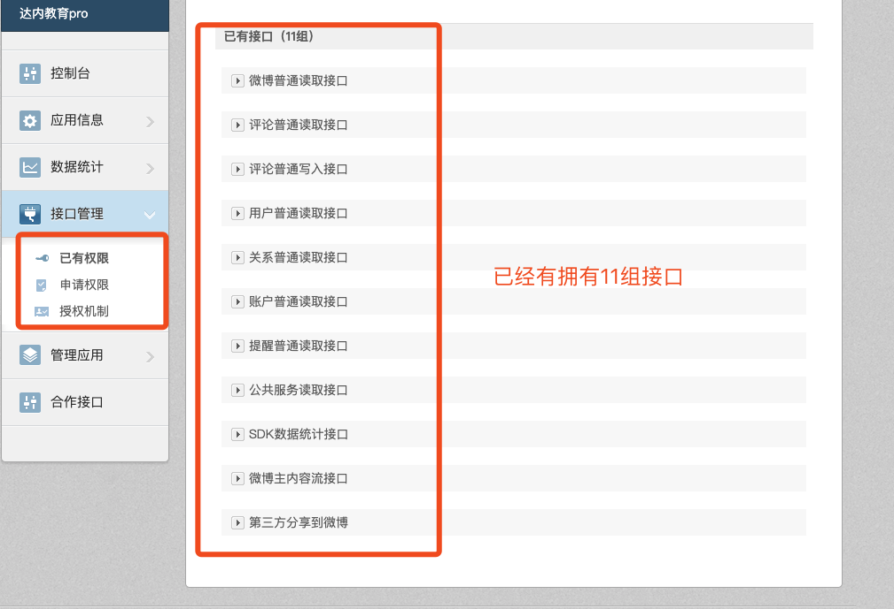

具体的示例如下：

**<font color=red>获取用户的关注列表</font>**

```http
URL ：https://api.weibo.com/2/friendships/friends.json
支持格式：JSON
HTTP请求方式；GET
是否需要登陆：是，也就是需要获取用户授权

```

请求参数

|     参数     | 必选  | 类型及范围 |                             说明                             |
| :----------: | :---: | :--------: | :----------------------------------------------------------: |
| access_token | true  |   string   |        采用OAuth授权方式为必填参数，OAuth授权后获得。        |
|     uid      | false |   int64    |                     需要查询的用户UID。                      |
| screen_name  | false |   string   |                     需要查询的用户昵称。                     |
|    count     | false |    int     |          单页返回的记录条数，默认为5，最大不超过5。          |
|    cursor    | false |    int     | 返回结果的游标，下一页用返回值里的next_cursor，上一页用previous_cursor，默认为0。 |
| trim_status  | false |    int     | 返回值中user字段中的status字段开关，0：返回完整status字段、1：status字段仅返回status_id，默认为1。 |

注意事项：

- 参数uid与screen_name二者必选其一，且只能选其一；

- 接口升级后：uid与screen_name只能为当前授权用户；

- 只返回同样授权本应用的用户，非授权用户将不返回；

- 例如一次调用count是5，但其中授权本应用的用户只有1条，则实际只返回1条；

  ```python
  '''
  https://api.weibo.com/2/friendships/friends.json?access_token=2.00UzNgEInV8OJC749c7200121aKjCD&uid=7398231560
  
  可以获取access_token 和 uid ,做出如此的尝试，会获取该用户的关注数据
  '''
  ```


返回数据参数说明：

| 返回值字段         | 字段类型 | 字段说明                                                     |
| :----------------- | :------- | :----------------------------------------------------------- |
| id                 | int64    | 用户UID                                                      |
| idstr              | string   | 字符串型的用户UID                                            |
| screen_name        | string   | 用户昵称                                                     |
| name               | string   | 友好显示名称                                                 |
| province           | int      | 用户所在省级ID                                               |
| city               | int      | 用户所在城市ID                                               |
| location           | string   | 用户所在地                                                   |
| description        | string   | 用户个人描述                                                 |
| url                | string   | 用户博客地址                                                 |
| profile_image_url  | string   | 用户头像地址（中图），50×50像素                              |
| profile_url        | string   | 用户的微博统一URL地址                                        |
| domain             | string   | 用户的个性化域名                                             |
| weihao             | string   | 用户的微号                                                   |
| gender             | string   | 性别，m：男、f：女、n：未知                                  |
| followers_count    | int      | 粉丝数                                                       |
| friends_count      | int      | 关注数                                                       |
| statuses_count     | int      | 微博数                                                       |
| favourites_count   | int      | 收藏数                                                       |
| created_at         | string   | 用户创建（注册）时间                                         |
| following          | boolean  | 暂未支持                                                     |
| allow_all_act_msg  | boolean  | 是否允许所有人给我发私信，true：是，false：否                |
| geo_enabled        | boolean  | 是否允许标识用户的地理位置，true：是，false：否              |
| verified           | boolean  | 是否是微博认证用户，即加V用户，true：是，false：否           |
| verified_type      | int      | 暂未支持                                                     |
| remark             | string   | 用户备注信息，只有在查询用户关系时才返回此字段               |
| status             | object   | 用户的最近一条微博信息字段 [详细](http://open.weibo.com/wiki/常见返回对象数据结构#.E5.BE.AE.E5.8D.9A.EF.BC.88status.EF.BC.89) |
| allow_all_comment  | boolean  | 是否允许所有人对我的微博进行评论，true：是，false：否        |
| avatar_large       | string   | 用户头像地址（大图），180×180像素                            |
| avatar_hd          | string   | 用户头像地址（高清），高清头像原图                           |
| verified_reason    | string   | 认证原因                                                     |
| follow_me          | boolean  | 该用户是否关注当前登录用户，true：是，false：否              |
| online_status      | int      | 用户的在线状态，0：不在线、1：在线                           |
| bi_followers_count | int      | 用户的互粉数                                                 |
| lang               | string   | 用户当前的语言版本，zh-cn：简体中文，zh-tw：繁体中文，en：英语 |

调用示例：

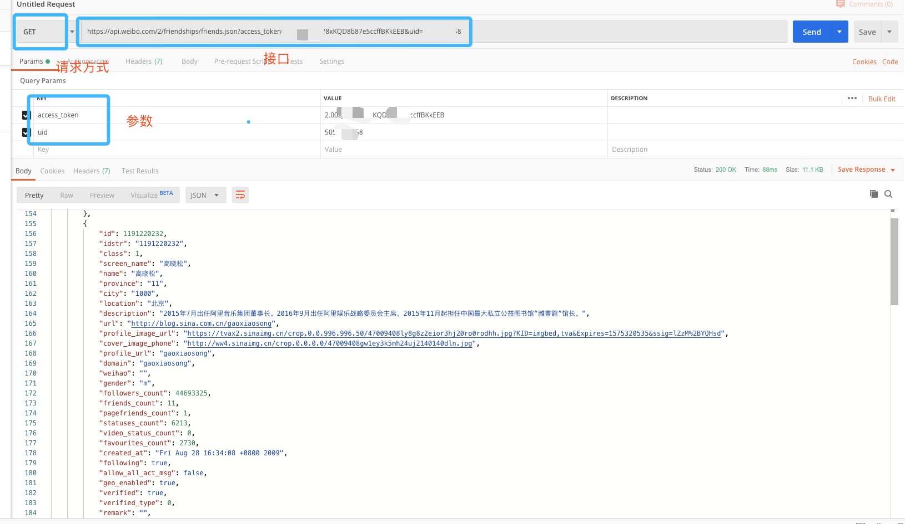