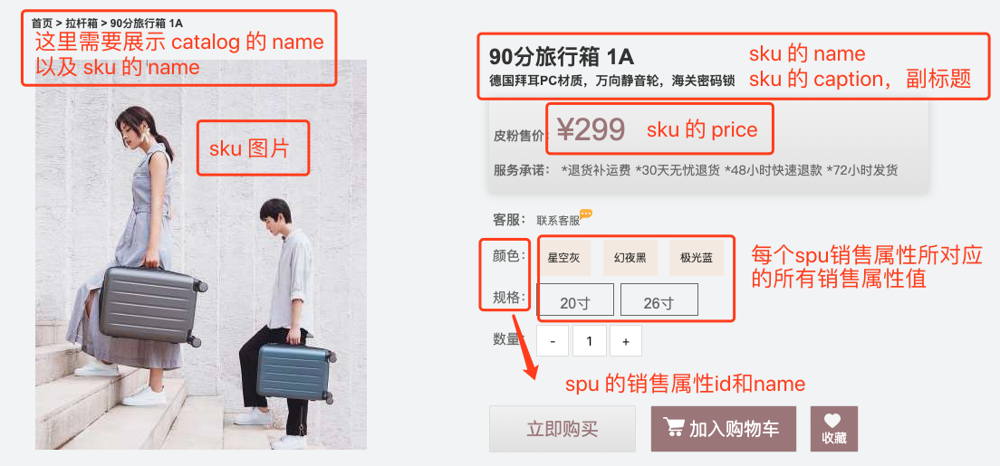

# 《达达商城》商品模块API文档说明

## SPU和SKU

> 在电商中对于商品，有两个重要的概念：**SPU**和**SKU**

### 1. SPU介绍

- SPU = Standard Product Unit （标准产品单位）
    - SPU是商品信息聚合的最小单位，是一组可服用、易检索的标准化信息的集合，该集合描述了一个产品的特性。
    - 通俗的讲，属性值、特性相同的商品就可以归类到一类SPU。
    - 例如:
        - `iPhone X` 就是一个**SPU**，与商家、颜色、款式、规格、套餐等都无关。


### 2. SKU介绍

**SKU = Stock Keeping Unit （库存量单位）**

- SKU即库存进出计量的单位，可以是以件、盒等为单位，是物理上不可分割的最小存货单元。
- 通俗的讲，SKU是指一款商品，每款都有一个SKU，便于电商品牌识别商品。
- 例如：
    - `iPhone X 全网通 黑色 256G` 就是一个**SKU**，表示了具体的规格、颜色等信息。


## 表结构设计以及models

### 1、表结构设计


### 2、models编写

根据之前设计好的表结构来写models.py文件

```python
from django.db import models
from utils.basemodel import BaseModel


# Create your models here.
class Catalog(BaseModel):
    """
    商品类别
    """
    name = models.CharField(max_length=10, verbose_name='类别名称')

    class Meta:
        verbose_name = '商品类别'
        verbose_name_plural = verbose_name

    def __str__(self):
        return self.name


class Brand(BaseModel):
    """
    品牌
    """

    name = models.CharField(max_length=20, verbose_name='商品名称')
    logo = models.ImageField(verbose_name='Logo图片', upload_to='brand')
    first_letter = models.CharField(max_length=1, verbose_name='品牌首字母')

    class Meta:
        verbose_name = '品牌'
        verbose_name_plural = verbose_name

    def __str__(self):
        return self.name


class SPU(BaseModel):
    name = models.CharField(max_length=50, verbose_name='名称')
    sales = models.IntegerField(default=0, verbose_name='商品销量')
    comments = models.IntegerField(default=0, verbose_name='评价数量')
    brand = models.ForeignKey(Brand, verbose_name='品牌', on_delete=models.CASCADE)
    catalog = models.ForeignKey(Catalog, verbose_name='商品类别', on_delete=models.CASCADE)

    class Meta:
        verbose_name = 'SPU'
        verbose_name_plural = verbose_name

    def __str__(self):
        return self.name


class SPUSaleAttr(BaseModel):
    """
    SPU销售属性表
    """
    spu = models.ForeignKey(SPU, on_delete=models.CASCADE)
    name = models.CharField(max_length=20, verbose_name='SPU属性名称')

    class Meta:
        db_table = 'goods_spu_sale_attr'
        verbose_name = 'SPU销售属性'
        verbose_name_plural = verbose_name

    def __str__(self):
        return '%s' % (self.name)


class SaleAttrValue(BaseModel):
    """
    销售属性值表
    """
    spu_sale_attr = models.ForeignKey(SPUSaleAttr, on_delete=models.CASCADE, verbose_name='销售属性')
    name = models.CharField(max_length=20, verbose_name='销售属性值名称')

    class Meta:
        db_table = 'goods_sale_attr_value'
        verbose_name = '销售属性值'
        verbose_name_plural = verbose_name

    def __str__(self):
        # return '%s - %s - %s' % (self.sale_attr_id, self.sku.name, self.sale_attr_value_name)
        return '%s - %s' % (self.spu_sale_attr, self.name)


class SKU(BaseModel):
    """
    SKU
    """
    name = models.CharField(max_length=50, verbose_name='SKU名称')
    caption = models.CharField(max_length=100, verbose_name='副标题')
    spu = models.ForeignKey(SPU, on_delete=models.CASCADE)
    price = models.DecimalField(max_digits=10, decimal_places=2, verbose_name='单价')
    cost_price = models.DecimalField(max_digits=10, decimal_places=2, verbose_name='进价')
    market_price = models.DecimalField(max_digits=10, decimal_places=2, verbose_name='市场价')
    stock = models.IntegerField(default=0, verbose_name='库存')
    sales = models.IntegerField(default=0, verbose_name='销量')
    comments = models.IntegerField(default=0, verbose_name='评价数')
    is_launched = models.BooleanField(default=True, verbose_name='是否上架销售')
    default_image_url = models.ImageField(verbose_name='默认图片', default=None, upload_to='sku')
    version = models.IntegerField(default=0, verbose_name="库存版本")
    sale_attr_value = models.ManyToManyField(SaleAttrValue)

    class Meta:
        verbose_name = 'SKU表'
        verbose_name_plural = verbose_name

    def __str__(self):
        return '%s: %s' % (self.id, self.name)


class SKUImage(BaseModel):
    """
        SKU图片
    """
    sku = models.ForeignKey(SKU, on_delete=models.CASCADE, verbose_name='sku')
    image = models.ImageField(verbose_name='图片路径', upload_to='sku_images')

    class Meta:
        db_table = 'goods_sku_image'
        verbose_name = 'SKU图片'
        verbose_name_plural = verbose_name

    def __str__(self):
        return '%s %s' % (self.sku.name, self.id)


class SPUSpec(BaseModel):
    """
    SPU规格表
    """
    spu = models.ForeignKey(SPU, on_delete=models.CASCADE)
    name = models.CharField(max_length=20, verbose_name='SPU规格名称')

    class Meta:
        db_table = 'goods_spu_spec'
        verbose_name = 'SPU规格'
        verbose_name_plural = verbose_name

    def __str__(self):
        return '%s: %s' % (self.spu.name, self.name)


class SKUSpecValue(BaseModel):
    """
    SKU规格属性表
    """
    sku = models.ForeignKey(SKU, on_delete=models.CASCADE)
    spu_spec = models.ForeignKey(SPUSpec, on_delete=models.CASCADE)
    name = models.CharField(max_length=20, verbose_name='SKU规格名称值')

    class Meta:
        db_table = 'goods_spu_spec_value'
        verbose_name = 'SKU规格属性值表'
        verbose_name_plural = verbose_name

    def __str__(self):
        return '%s: %s: %s' % (self.sku, self.spu_spec.name, self.name)

```

## 一、首页展示

### 1. 接口设计

接口设计遵循 restful 设计模式，在 dashop 下的url：

```python
urlpatterns = [
    path('v1/goods', include('goods.urls')),
]
```

在 goods app 下的商城首页展示 url 设计：

```python
urlpatterns = [
    path('index', views.GoodsIndexView.as_view()),
]
```

### 2. 细节说明

首页展示主要是根据 catalog 来展示，在每个 catalog 分类下展示其中三个 sku，需要展示每个 sku 的***名称，副标题，价格，图片***等信息。与此同时还需要展示 ***catalog 名称***。


可以根据 catalog 查询到该分类下的 spu，之后再根据 spu 查询到所需的 sku。

```python
# 1.获取指定分类的 spu
spu_ids = SPU.objects.filter(catalog=cata.id).values("id")
# 2.获取指定 spu 下的 sku
sku_list = SKU.objects.filter(SPU_ID__in=spu_ids, is_launched=True)
```


##### 注意：在做首页展示的时候，必须保证每个 catalog 下至少有三个 sku 的数据，否则页面显示异常。


## 二、列表页展示

### 1. 接口设计

接口设计遵循 restful 设计模式，在 dashop 下的url：

```python
urlpatterns = [
    path('v1/goods/', include('goods.urls')),
]
```

在 goods app 下的列表页展示 url 设计：

```python
urlpatterns = [
    # 需要传入 catalog_id，因为分类是根据类别的 id 去区分的
    path('catalogs/(?P<catalog_id>\d+)', views.GoodsListView.as_view()),
]
```

### 2. 细节说明

分类是根据sku在列表页会显示该分类下的所有 sku，此处的图片为 sku 表中的 default_image_url


### **Django 中的分页功能**

Django 提供了一个新的类来帮助你管理分页数据，这个类存放在`django/core/paginator.py`.它可以接收列表、元组或其它可迭代的对象。项目的列表展示中运用到了分页功能，是使用 ***Paginator*** 实现的。下面是Paginator 的具体使用方式：

```python
import os
# 导入模块
from django.core.paginator import Paginator
data_list = ['a', 'b', 'c', 'd', 'e', 'f', 'g', 'h', 'i', 'j']
p = Paginator(data_list, 3)  # 3条数据为一页，实例化分页对象
print(p.count)  # 10 对象总共10个元素
print(p.num_pages)  # 4 对象可分4页
print(p.page_range)  # range(1, 5)对象页的可迭代范围
 
page1 = p.page(1)  # 取对象的第一分页对象
print(page1.object_list)  # 第一分页对象的元素列表['a', 'b', 'c']
print(page1.number)  # 第一分页对象的当前页值 1
 
page2 = p.page(2)  # 取对象的第二分页对象
print(page2.object_list)  # 第二分页对象的元素列表 ['d', 'e', 'f']
print(page2.number)  # 第二分页对象的当前页码值 2
 
print(page1.has_previous())  # 第一分页对象是否有前一页 False
print(page1.has_other_pages())  # 第一分页对象是否有其它页 True
 
print(page2.has_previous())  # 第二分页对象是否有前一页 True
print(page2.has_next())  # 第二分页对象是否有下一页 True
print(page2.next_page_number())  # 第二分页对象下一页码的值 3
print(page2.previous_page_number())  # 第二分页对象的上一页码值 1
print(page2.start_index())  # 第二分页对象的元素开始索引 4
print(page2.end_index())  # 第2分页对象的元素结束索引 6
```

我们给前端传递数据的时候，要实现分页功能，只需要传递每一页显示多少条数据 pagesize ，以及总共的记录数 total 即可。

#### 3. 代码说明

```python

```

## 三、 详情页展示

### 1. 接口设计

接口设计遵循 restful 设计模式，在 dashop 下的url：

```python
urlpatterns = [
    path('v1/goods/', include('goods.urls')),
]
```

在 goods app 下的商城首页展示 url 设计：

```python
urlpatterns = [
    path('detail/<int:sku_id>', views.GoodsDetailView.as_view()),
]
```

### 2. 细节说明

详情页展示，展示的是每个 sku 下的具体信息，所以需要参数 sku_id。

这里需要传递的数据有：

1. 类别的id，类别的名称
2. sku的名称，sku的副标题，sku的id，sku的图片
3. spu的销售属性id以及名称以及销售属性值id以及名称



这里还有个需要注意的地方，就是 sku 销售属性值高亮显示的问题，当我们打开一个详情页的时候，必然是所有的属性已经有了该 sku 的所有销售属性值，并将该 sku 的属性值高亮显示，所以我们还需要从 SKUSaleAttrValue  和 SaleAttrValue 表中拿到 sku 销售属性值的id和name，将数据交给前端进行比较，从而高亮显示：


至于切换在详情页切换 sku 的功能会在后续说到。

在详情页下半部分还有需要注意的地方就是商品规格部分和详情页大图部分：


与规格相关的两张表是 SPUSpec 以及 SKUSpecValue 表，与详情大图挂钩的是 SKUImage 表。

规格的归属单位是 SPU，而具体的规格属性是根据不同的 SKU 来决定的。

```python
# sku规格部分
# 用于存放规格相关数据，格式：{规格名称1: 规格值1, 规格名称2: 规格值2, ...}
spec = dict()
sku_spec_values = SKUSpecValue.objects.filter(sku=sku_id)
if not sku_spec_values:
    sku_details['spec'] = dict()
else:
    for sku_spec_value in sku_spec_values:
        spec[sku_spec_value.spu_spec.spec_name] = sku_spec_value.name
    sku_details['spec'] = spec
```

在详情页使用到了 redis 做数据缓存，作用是如果在指定时间内请求访问同一个 sku 下的数据时，直接从缓存中拿数据，减轻数据库压力。

### 3. 代码说明

```python
def get(self, request, sku_id):
        """
        获取sku详情页信息，获取图片暂未完成
        :param request:
        :param sku_id: sku的id
        :return:
        """
        # 127.0.0.1:8000/v1/goods/detail/1
        # 获取sku实例
        print('----goods detail view in----')

        sku_details = {}

        try:
            sku_item = SKU.objects.get(id=sku_id)
        except:
            # 判断是否有当前sku
            result = {'code': 40300, 'error': "Such sku doesn' exist", }
            return JsonResponse(result)
        sku_catalog = sku_item.spu.catalog
        sku_details['image'] = str(sku_item.default_image_url)
        sku_details["spu"] = sku_item.spu.id
        sku_details["name"] = sku_item.name
        sku_details["caption"] = sku_item.caption
        sku_details["price"] = str(sku_item.price)
        sku_details["catalog_id"] = sku_catalog.id
        sku_details["catalog_name"] = sku_catalog.name

        # 详情图片
        sku_image = SKUImage.objects.filter(sku=sku_item)
        if sku_image:
            sku_details['detail_image'] = str(sku_image[0].image)
        else:
            sku_details['detail_image'] = ""

        sku_sale_attr_id = []  # 存放销售属性id
        sku_sale_attr_names = [] # 存放销售属性name
        #spu_sale_attrs = SPUSaleAttr.objects.filter(SPU_id=sku_item.SPU_ID.id).order_by("weight")
        spu_sale_attrs = SPUSaleAttr.objects.filter(spu=sku_item.spu.id)
        for attr in spu_sale_attrs:
            sku_sale_attr_id.append(attr.id)
            sku_sale_attr_names.append(attr.name)


        sku_sale_attr_val_id = [i.id for i in sku_item.sale_attr_value.all()]

  
        all_sale_attr_vals_id = {} # 存放这个sku所属的spu所有销售属性对应的所有销售属性值id
        all_sale_attr_vals_name = {} # 存放这个sku所属的spu所有销售属性对应的所有销售属性值name
        for id in sku_sale_attr_id:
            items = SaleAttrValue.objects.filter(spu_sale_attr=id)
            sku_all_sale_attr_vals_id[id] = []
            sku_all_sale_attr_vals_name[id] = []
            for it in items:
                all_sale_attr_vals_id[id].append(it.id)
                all_sale_attr_vals_name[id].append(it.name)
        sku_details['sku_sale_attr_id'] = sku_sale_attr_id
        sku_details['sku_sale_attr_names'] = sku_sale_attr_names
        sku_details['sku_sale_attr_val_id'] = sku_sale_attr_val_id
        sku_details['sku_all_sale_attr_vals_id'] = all_sale_attr_vals_id
        sku_details['sku_all_sale_attr_vals_name'] = all_sale_attr_vals_name

        # sku规格部分
        # 用于存放规格相关数据，格式：{规格名称1: 规格值1, 规格名称2: 规格值2, ...}
        spec = dict()
        sku_spec_values = SKUSpecValue.objects.filter(sku=sku_id)
        if not sku_spec_values:
            sku_details['spec'] = dict()
        else:
            for sku_spec_value in sku_spec_values:
                spec[sku_spec_value.spu_spec.name] = sku_spec_value.name
            sku_details['spec'] = spec

        result = {'code': 200, 'data': sku_details, 'base_url': settings.PIC_URL}
        return JsonResponse(result)
```


## 四、搜索功能

### 1. 接口设计

接口设计遵循 restful 设计模式，在 dashop 下的url：

```python
urlpatterns = [
    path('v1/goods', include('goods.urls')),
]
```

在 goods app 下的商城首页展示 url 设计：

```python
urlpatterns = [
    path('/search', views.GoodsSearchView.as_view()),
]
```

### 2. 细节说明

搜索功能使用了 Elasticsearch 搜索引擎。

### 3. 代码说明

```python
class GoodsSearchView(View):
    def post(self,request, load_all=True, searchqueryset=None):
        """
        首页查询功能
        :param request:
        :return:
        """
        # 127.0.0.1:8000/v1/goods/search/
        from dadashop.settings import HAYSTACK_SEARCH_RESULTS_PER_PAGE
        query = ''
        page_size = HAYSTACK_SEARCH_RESULTS_PER_PAGE
        results = EmptySearchQuerySet()
        if request.POST.get('q'):
            form = ModelSearchForm(request.POST, searchqueryset=searchqueryset, load_all=load_all)
            if form.is_valid():
                query = form.cleaned_data['q']
                results = form.search()
        else:
            form = ModelSearchForm(searchqueryset=searchqueryset, load_all=load_all)

        paginator = Paginator(results, page_size)
        try:
            page = paginator.page(int(request.POST.get('page', 1)))
        except:
            result = {'code': 40200, 'error': '页数有误，小于0或者大于总页数'}
            return JsonResponse(result)

        # 记录查询信息
        context = {
            'form': form,
            'page': page,
            'paginator': paginator,
            'query': query,
        }

        sku_list = []
        # print(len(page.object_list))
        for result in page.object_list:
            sku = {
                'skuid': result.object.id,
                'name': result.object.name,
                'price': result.object.price,
            }
            # 获取图片
            sku_image = str(result.object.default_image_url)
            sku['image'] = sku_image
            sku_list.append(sku)
        result = {"code": 200, "data": sku_list, 'paginator': {'pagesize': page_size, 'total': len(results)}, 'base_url': PIC_URL}
        return JsonResponse(result)
```

## 五、详情页 SKU 切换功能

### 1. 功能设计

根据修改 SKU 的销售属性值确定出不同的sku，进而修改详情页的展示数据。

### 2. 代码展示

```python
class GoodsChangeSkuView(View):
    def post(self, request):
        data = json.loads(request.body)
        # 将前端传来的销售属性值id放入列表
        sku_vals = []
        result = {}
        for k in data:
            if 'spuid' != k:
                sku_vals.append(data[k])
        sku_list = SKU.objects.filter(SPU_ID=data['spuid'])

        for sku in sku_list:
            sku_details = dict()
            sku_details['sku_id'] = sku.id
            # 获取sku销售属性值id
            sale_attrs_val_lists = SaleAttrValue.objects.filter(sku=sku.id)
            sale_attr_val_id = []

            for sale_attrs_val in sale_attrs_val_lists:
                sale_attr_val_id.append(sale_attrs_val.id)

            if sku_vals == sale_attr_val_id:
                result = {"code": 200, "data": sku.id,}
        if len(result) == 0:
            result = {"code": 40050, "error": "no such sku",}
        return JsonResponse(result)
```

## 六、商品上架以后后台管理功能

### 功能设计

我们将商品上架功能放到 admin 中来实现，需要分别对商品部分的十张表进行不同的操作，进而实现商品上架。上面首页展示提到本地缓存管理，意思是如果后台数据有变化的情况，我们需要清空缓存，否则会出现数据显示异常的情况，可以跟进 Django 的源码进行分析（打断点，debug），最后得出所有的修改和删除的保存都是调用了 ModelAdmin 中的 save_model 和 delete_model 这两个方法，根据这个条件进行修改。

我们需要管理的缓存包括首页数据缓存和详情页数据缓存两部分。

首页页缓存可以按如下方式删除：

```python
GOODS_CACHES = caches['goods']
GOODS_CACHES.clear()
```

详情页缓存可以按如下方式删除【需要有具体sku的key】：

```python
GD_CACHES = caches['goods_detail']
GD_CACHES.delete(cache_key)
```

### admin模块代码（可拓展）展示：

```python
from django.contrib import admin
from .models import *

from django.core.cache import caches
GOODS_CACHES = caches['goods']
GD_CACHES = caches['goods_detail']


class BaseModel(admin.ModelAdmin):
    """
    继承admin.ModelAdmin
    重写save_model / delete_model 方法
    """
    def save_model(self, request, obj, form, change):
        super().save_model(request, obj, form, change)
        # 删除首页缓存
        GOODS_CACHES.clear()
        print("保存数据时，首页缓存删除")

    def delete_model(self, request, obj):
        super().delete_model(request, obj)
        # 删除首页缓存
        GOODS_CACHES.clear()
        print("删除数据时，首页缓存删除")

    def delete_goods_detail_cache(self, sku_id):

        cache_key = 'gd%s'%(sku_id)
        GD_CACHES.delete(cache_key)


@admin.register(Brand)
class BrandAdmin(BaseModel):
    list_display = ['id', 'name']

    # list_per_page设置每页显示多少条记录，默认是100条
    list_per_page = 20

    # ordering设置默认排序字段，创建时间降序排序
    ordering = ('created_time',)


@admin.register(Catalog)
class CatalogAdmin(BaseModel):
    list_display = ['id', 'name']

    # list_per_page设置每页显示多少条记录，默认是100条
    list_per_page = 20

    # ordering设置默认排序字段，创建时间降序排序
    ordering = ('created_time',)


@admin.register(SPU)
class SPUAdmin(BaseModel):

    list_display = ['id', 'name', 'catalog']

    # list_per_page设置每页显示多少条记录，默认是100条
    list_per_page = 20

    # ordering设置默认排序字段，创建时间降序排序
    ordering = ('created_time',)

    # fk_fields 设置显示外键字段
    fk_fields = ('catalog',)

    search_fields = ('name', )  # 搜索字段


@admin.register(SPUSaleAttr)
class SPUSaleAttrAdmin(BaseModel):

    def save_model(self, request, obj, form, change):
        super().save_model(request, obj, form, change)
        # 删除首页缓存
        GOODS_CACHES.clear()
        #删除spu对应的sku缓存
        all_sku_ids = obj.spu.sku_set.values('id')
        for sid in all_sku_ids:
            _id = sid['id']
            self.delete_goods_detail_cache(_id)
        print("保存数据时，首页缓存删除，详情页缓存删除")

    def delete_model(self, request, obj):
        all_sku_ids = obj.spu.sku_set.values('id')
        super().delete_model(request, obj)
        # 删除首页缓存
        GOODS_CACHES.clear()
        #删除spu对应的sku缓存
        for sid in all_sku_ids:
            _id = sid['id']
            self.delete_goods_detail_cache(_id)
        print("保存数据时，首页缓存删除，详情页缓存删除")

    list_display = ['id', 'spu', 'name']

    # list_per_page设置每页显示多少条记录，默认是100条
    list_per_page = 20

    # ordering设置默认排序字段，创建时间降序排序
    ordering = ('created_time',)

    # fk_fields 设置显示外键字段
    fk_fields = ('spu',)

    search_fields = ('name',)  # 搜索字段


@admin.register(SKU)
class SKUAdmin(BaseModel):

    def save_model(self, request, obj, form, change):
        super().save_model(request, obj, form, change)
        GOODS_CACHES.clear()
        self.delete_goods_detail_cache(obj.id)
        print("保存数据时，首页缓存删除，详情页缓存删除")

    def delete_model(self, request, obj):
        super().delete_model(request, obj)
        # 删除首页缓存
        GOODS_CACHES.clear()
        self.delete_goods_detail_cache(obj.id)
        print("保存数据时，首页缓存删除，详情页缓存删除")

    list_display = ['id', 'name', 'spu', 'is_launched',]
    # list_per_page设置每页显示多少条记录，默认是100条
    list_per_page = 20

    # ordering设置默认排序字段，创建时间降序排序
    ordering = ('created_time',)

    # fk_fields 设置显示外键字段
    fk_fields = ('spu',)

    search_fields = ('name',)  # 搜索字段


@admin.register(SaleAttrValue)
class SaleAttrValueAdmin(BaseModel):
    list_display = ['id', 'name', 'spu_sale_attr',]
    # list_per_page设置每页显示多少条记录，默认是100条
    list_per_page = 20

    # ordering设置默认排序字段，创建时间降序排序
    ordering = ('created_time',)

    # fk_fields 设置显示外键字段
    fk_fields = ('spu_sale_attr',)

    search_fields = ('name',)  # 搜索字段


@admin.register(SKUImage)
class SKUImageAdmin(BaseModel):

    def save_model(self, request, obj, form, change):
        super().save_model(request, obj, form, change)
        # 删除详情页缓存
        self.delete_goods_detail_cache(obj.sku.id)
        print("sku.id", obj.sku.id)
        print("保存数据时，详情页缓存清除")

    def delete_model(self, request, obj):
        super().delete_model(request, obj)
        # 删除详情页缓存
        self.delete_goods_detail_cache(obj.sku.id)
        print("sku.id", obj.sku.id)
        print("保存数据时，详情页缓存清除")

    list_display = ['id', 'sku', 'image',]
    # list_per_page设置每页显示多少条记录，默认是100条
    list_per_page = 20

    # ordering设置默认排序字段，创建时间降序排序
    ordering = ('created_time',)

    # fk_fields 设置显示外键字段
    fk_fields = ('sku',)


@admin.register(SPUSpec)
class SPUSpecAdmin(BaseModel):

    list_display = ['id', 'spu', 'name']

    # list_per_page设置每页显示多少条记录，默认是100条
    list_per_page = 20

    # ordering设置默认排序字段，创建时间降序排序
    ordering = ('created_time',)

    # fk_fields 设置显示外键字段
    fk_fields = ('spu',)

    search_fields = ('name',)  # 搜索字段


@admin.register(SKUSpecValue)
class SKUSpecValueAdmin(BaseModel):

    def save_model(self, request, obj, form, change):
        super().save_model(request, obj, form, change)
        # 删除详情页缓存
        self.delete_goods_detail_cache(obj.sku.id)
        print("sku.id", obj.sku.id)
        print("保存数据时，详情页缓存清除")

    def delete_model(self, request, obj):
        super().delete_model(request, obj)
        # 删除详情页缓存
        self.delete_goods_detail_cache(obj.sku.id)
        print("保存数据时，详情页缓存清除")

    list_display = ['id', 'sku', 'spu_spec', 'name']

    # list_per_page设置每页显示多少条记录，默认是100条
    list_per_page = 20

    # ordering设置默认排序字段，创建时间降序排序
    ordering = ('created_time',)

    # fk_fields 设置显示外键字段
    fk_fields = ('sku', 'spu_spec')

    search_fields = ('spec_name',)  # 搜索字段
```

