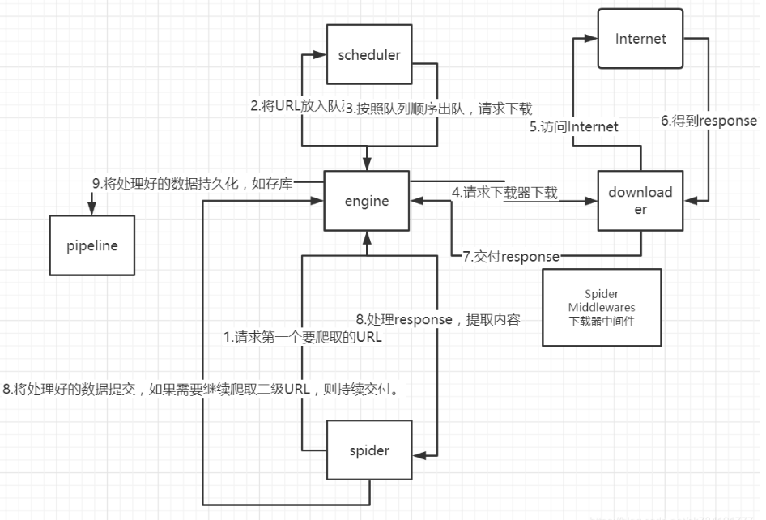
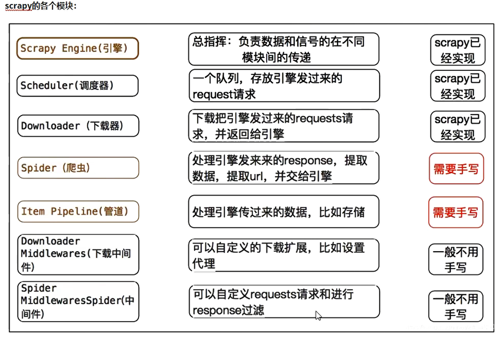
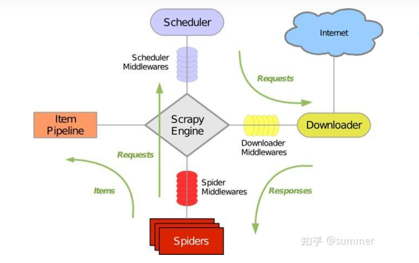
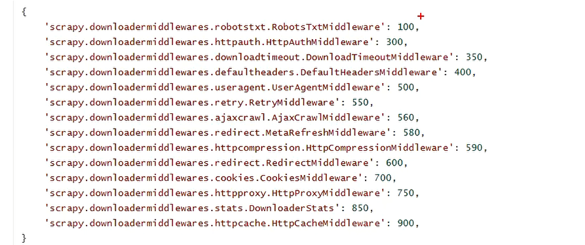

# Scrapy框架

## 简介

Scrapy是纯Python开发的一个高效,结构化的网页抓取框架；

Scrapy是一个为了爬取网站数据，提取结构性数据而编写的应用框架。 其最初是为了页面抓取 (更确切来说, 网络抓取 )所设计的，也可以应用在获取API所返回的数据(例如 Amazon Associates Web Services ) 或者通用的网络爬虫。 Scrapy用途广泛,可以用于数据挖掘、监测和自动化测试 Scrapy使用了Twisted 异步网络库来处理网络通讯。

**使用原因：**

1.为了更利于我们将精力集中在请求与解析上 
2.企业级的要求 工程化

## 安装

scrapy支持Python2.7和python3.4以上版本。

* **Windows**
  
  * 一.直接安装
    * 执行pip install scrapy
  * 二.annaconda 下安装
    * 1.安装conda
      * conda旧版本  https://docs.anaconda.com/anaconda/packages/oldpkglists/
        * 安装方法     https://blog.csdn.net/ychgyyn/article/details/82119201
    * 2.安装scrapy   conda/pip  install scrapy 
  
* **Ubuntu 14.04或以上**

  scrapy目前正在使用最新版的lxml，twisted和pyOpenSSL进行测试，并且与最近的Ubuntu发行版兼容。但它也支持旧版本的Ubuntu，比如Ubuntu14.04，尽管可能存在TLS连接问题。

  **Ubuntu安装注意事项**
  不要使用 python-scrapyUbuntu提供的软件包，它们通常太旧而且速度慢，无法赶上最新的Scrapy。

  要在Ubuntu（或基于Ubuntu）系统上安装scrapy，您需要安装这些依赖项：

  **sudo apt-get install python-dev python-pip libxml2-dev libxslt1-dev zlib1g-dev  libffi-dev  libssl-dev**

  如果你想在python3上安装scrapy，你还需要Python3的开发头文件：

  **sudo apt-get install python3-dev**

  在virtualenv中，你可以使用pip安装Scrapy：

  **pip install scrapy**
  ​


## 运行流程




（
spiders网页爬虫
items项目
engine引擎
scheduler调度器
downloader下载器
item pipelines项目管道
middleware中间设备，中间件
）

### 数据流：

上图显示了Scrapy框架的体系结构及其组件，以及系统内部发生的数据流（由红色的箭头显示。）
Scrapy中的数据流由执行引擎控制,流程如下：

1. 首先从网页爬虫获取初始的请求
2. 将请求放入调度模块，然后获取下一个需要爬取的请求
3. 调度模块返回下一个需要爬取的请求给引擎
4. 引擎将请求发送给下载器，依次穿过所有的下载中间件
5. 一旦页面下载完成，下载器会返回一个响应包含了页面数据，然后再依次穿过所有的下载中间件。
6. 引擎从下载器接收到响应，然后发送给爬虫进行解析，依次穿过所有的爬虫中间件
7. 爬虫处理接收到的响应，然后解析出item和生成新的请求，并发送给引擎
8. 引擎将已经处理好的item发送给管道组件，将生成好的新的请求发送给调度模块，并请求下一个请求
9. 该1-8过程重复，直到调度程序不再有请求为止。

### 组件介绍



* Scrapy Engine(引擎)
  引擎负责控制系统所有组件之间的数据流，并在发生某些操作时触发事件。

* scheduler（调度器)
  调度程序接收来自引擎的请求，将它们排入队列，以便稍后引擎请求它们。

* Downloader（下载器)
  下载程序负责获取web页面并将它们提供给引擎，引擎再将它们提供给spider。

* spider（爬虫）
  爬虫是由用户编写的自定义的类，用于发起请求，解析响应，从中提取数据，或其他要抓取的请求。
* Item pipeline（管道)
  管道负责在数据被爬虫提取后进行后续处理。典型的任务包括清理，验证和持久性（如将数据存储在数据库中）

* 下载中间件
  下载中间件是位于引擎和下载器之间的特定的钩子，它们处理从引擎传递到下载器的请求，以及下载器传递到引擎的响应。
  如果你要执行以下操作之一，请使用Downloader中间件：
  在请求发送到下载程序之前处理请求（即在scrapy将请求发送到网站之前）
  在响应发送给爬虫之前
  直接发送新的请求，而不是将收到的响应传递给蜘蛛
  将响应传递给爬行器而不获取web页面;
  默默的放弃一些请求

* 爬虫中间件
  爬虫中间件是位于引擎和爬虫之间的特定的钩子，能够处理传入的响应和传递出去的item和请求。
  如果你需要以下操作请使用爬虫中间件：
  处理爬虫回调之后的 请求或item
  处理start_requests
  处理爬虫异常
  根据响应内容调用errback而不是回调请


### 简单使用

#### 一.项目命令

1.创建项目:
scrapy startproject <project_name>  [project_dir]                               
	ps: "<>"表示必填 ,"[]"表示可选
scrapy startproject   info

2.cd 到项目下
	scrapy genspider [options]   <name>   <domain>
   	 scrapy genspider  example   example.com  

 	scrapy genspider  film   xxxx
 	
 	会创建在项目/spider下 ;其中example 是爬虫文件名,   example.com 是 url
3.运行项目
	scrapy  crawl 爬虫文件名   #注重流程
4.setting 里配置    ROBOTSTXT_OBEY;DEFAULT_REQUEST_HEADERS	

## ERROR:Loading "scrapy.core.downloader.handlers.http.HTTPDownloadHandler" for scheme "http"

卸载cryptography：pip uninstall cryptography
重新安装cryptography 36.0.2：pip install cryptography==36.0.2
卸载pyOpenSSL：pip uninstall pyOpenSSL
重新安装pyOpenSSL 22.0.0：pip install pyOpenSSL==22.0.0

## 爬取电影信息

网址  https://ssr1.scrape.center/

### **目标数据要求：**

1. 内容  电影名称,评分
2. 存储到  mysql


### 项目注意事项

1. settings文件中 项目默认的是  ROBOTSTXT_OBEY = True,即遵循robots协议,则不能爬取到数据

则更改为 ROBOTSTXT_OBEY = False

2. settings中,有些网站需要添加User-Agent ,才能获取到数据  (伪装成客户端)
3. settings中,需要将管道打开,才可以将数据传递到pipelines文件中
4. items中需要设置相应的字段,使用Item对象传递数据,(可以理解为mysql先定义字段,才能写入数据一样)


**动作**

* 1.setting中配置

* 2.熟悉简单的发起请求和得到响应

* 3.解析数据

* 4.存储数据

* 5.增加管道 存储到excel表格

  ```
  from  . import items
  
  class Scrapy01Pipeline:
      def open_spider(self, spider):
          self.f=  open('scrapy01.html', 'w',encoding='utf-8')
  
  
      def close_spider(self, spider):
          self.f.close()
  
      def process_item(self, item, spider):
          self.f.write(item['content']+'\n')
  
          if isinstance(item,items.Scrapy01Item):
              pass
          return item
  ```
  
  


# Scrapy框架基础用法




## 重写请求方法

* 作用

  * 初始url需要请求头信息
  * 初始url需要发起post请求

* 重写  start_requests

  ```
  import scrapy
  from scrapy import cmdline
  
  from scrapy01.items import Scrapy01Item
  
  class BaiduSpider(scrapy.Spider):
      name = 'baidu'
      allowed_domains = ['baidu.com']
      start_urls = ['http://baidu.com/']
  
      # def start_requests(self):
      #     for i in range(1,6):
      #         url = 'http://baidu.com/{}'.format(i)
      #         yield scrapy.Request(url=url, callback=self.parse)
  
      # def parse(self, response):
      #     循环处理页面的其他写法
      #     print(response.meta['page'])
      #     totalpage = response.json().get('totalpage')
      #     global page
      #     page += 1
      #     if page < totalpage:
      #         url = 'http://baidu.com/'
      #         data = {'dsf':'gfdsg'}
      #         yield scrapy.FormRequest(url=url,formdata=data,meta={'page':page},dont_filter=True)
  
      def parse(self, response):
          print(response.text)
  
          # 把数据保存到管道
          item = Scrapy01Item()
          item['content'] = response.text
  
  
          return item
  
  if __name__ == '__main__':
  
      cmdline.execute('scrapy crawl baidu'.split())
  
  
  ```
  
  
  
  

## 下载中间件

默认的中间件：



键为路径，值为优先级，越小越优先，None为禁止

请求和响应触发优先级相同，不是洋葱模型

自定义中间件：

* 方法含义介绍

  ```python
  class DownloaderMiddleware(object):
      # Not all methods need to be defined. If a method is not defined,
      # scrapy acts as if the downloader middleware does not modify the
      # passed objects.
  
      @classmethod
      def from_crawler(cls, crawler):
          # 初始化
          # This method is used by Scrapy to create your spiders.
          s = cls()
          crawler.signals.connect(s.spider_opened, signal=signals.spider_opened)
          return s
  
      def process_request(self, request, spider):
          # Called for each request that goes through the downloader
          #处理请求  参数  request  spider对象
          # middleware.
  
          # Must either:  以下必选其一
          # - return None: continue processing this request #返回None   request 被继续交个下一个中间件处理
          # - or return a Response object #返回response对象   不会交给下一个precess_request  而是交给下载器
          # - or return a Request object #返回一个request对象   直接交给引擎处理，重新进行调度
          # - or raise IgnoreRequest: process_exception() methods of   #抛出异常  process_exception处理
          #   installed downloader middleware will be called
          return None
  
      def process_response(self, request, response, spider):
          # Called with the response returned from the downloader.
          #处理响应  request, response, spider
  
          # Must either;
          # - return a Response object   #继续交给下一中间件处理
          # - return a Request object     #返回一个request对象   直接交给引擎处理
          # - or raise IgnoreRequest     #抛出异常    process_exception处理
          return response
  
      def process_exception(self, request, exception, spider):
          # Called when a download handler or a process_request()
          # (from other downloader middleware) raises an exception.
          #处理异常
  
          # Must either:
          # - return None: continue processing this exception  #继续调用其他中间件的process_exception
          # - return a Response object: stops process_exception() chain  #返回response  停止调用其他中间件的process_exception
          # - return a Request object: stops process_exception() chain   #返回request  直接交给引擎处理
          pass
  
      def spider_opened(self, spider):
          spider.logger.info('Spider opened: %s' % spider.name)
  ```


* UA池

  * middlewares文件设置用户代理

    ```python
    from .settings import user_agent_list
    class User_AgentDownloaderMiddleware(object):
    
        def process_request(self, request, spider):
            request.headers["User_Agent"]=random.choice(user_agent_list) #随机选择一个UA
            # Called for each request that goes through the downloader
            #处理请求  参数  request  spider对象
            # middleware.
    
            # Must either:  以下必选其一
            # - return None: continue processing this request  #返回None   request 被继续交个下一个中间件处理
            # - or return a Response object    #返回response对象   不会交给下一个precess_request  而是交给下载器
            # - or return a Request object     #返回一个request对象   直接交给引擎处理
            # - or raise IgnoreRequest: process_exception() methods of   #抛出异常  process_exception处理
            #   installed downloader middleware will be called
            return None
    ```

  * 用户代理池

    ```python
        user_agent_list = [
        "Mozilla/5.0 (Windows NT 6.1; WOW64) AppleWebKit/537.1 ",
        "(KHTML, like Gecko) Chrome/22.0.1207.1 Safari/537.1",
        "Mozilla/5.0 (X11; CrOS i686 2268.111.0) AppleWebKit/536.11 "
        "(KHTML, like Gecko) Chrome/20.0.1132.57 Safari/536.11",
        "Mozilla/5.0 (Windows NT 6.1; WOW64) AppleWebKit/536.6 "
        "(KHTML, like Gecko) Chrome/20.0.1092.0 Safari/536.6",
        "Mozilla/5.0 (Windows NT 6.2) AppleWebKit/536.6 "
        "(KHTML, like Gecko) Chrome/20.0.1090.0 Safari/536.6",
        "Mozilla/5.0 (Windows NT 6.2; WOW64) AppleWebKit/537.1 "
        "(KHTML, like Gecko) Chrome/19.77.34.5 Safari/537.1",
        "Mozilla/5.0 (X11; Linux x86_64) AppleWebKit/536.5 "
        "(KHTML, like Gecko) Chrome/19.0.1084.9 Safari/536.5",
        "Mozilla/5.0 (Windows NT 6.0) AppleWebKit/536.5 "
        "(KHTML, like Gecko) Chrome/19.0.1084.36 Safari/536.5",
        "Mozilla/5.0 (Windows NT 6.1; WOW64) AppleWebKit/536.3 "
        "(KHTML, like Gecko) Chrome/19.0.1063.0 Safari/536.3",
        "Mozilla/5.0 (Windows NT 5.1) AppleWebKit/536.3 "
        "(KHTML, like Gecko) Chrome/19.0.1063.0 Safari/536.3",
        "Mozilla/5.0 (Macintosh; Intel Mac OS X 10_8_0) AppleWebKit/536.3 "
        "(KHTML, like Gecko) Chrome/19.0.1063.0 Safari/536.3",
        "Mozilla/5.0 (Windows NT 6.2) AppleWebKit/536.3 "
        "(KHTML, like Gecko) Chrome/19.0.1062.0 Safari/536.3",
        "Mozilla/5.0 (Windows NT 6.1; WOW64) AppleWebKit/536.3 "
        "(KHTML, like Gecko) Chrome/19.0.1062.0 Safari/536.3",
        "Mozilla/5.0 (Windows NT 6.2) AppleWebKit/536.3 "
        "(KHTML, like Gecko) Chrome/19.0.1061.1 Safari/536.3",
        "Mozilla/5.0 (Windows NT 6.1; WOW64) AppleWebKit/536.3 "
        "(KHTML, like Gecko) Chrome/19.0.1061.1 Safari/536.3",
        "Mozilla/5.0 (Windows NT 6.1) AppleWebKit/536.3 "
        "(KHTML, like Gecko) Chrome/19.0.1061.1 Safari/536.3",
        "Mozilla/5.0 (Windows NT 6.2) AppleWebKit/536.3 "
        "(KHTML, like Gecko) Chrome/19.0.1061.0 Safari/536.3",
        "Mozilla/5.0 (X11; Linux x86_64) AppleWebKit/535.24 "
        "(KHTML, like Gecko) Chrome/19.0.1055.1 Safari/535.24",
        "Mozilla/5.0 (Windows NT 6.2; WOW64) AppleWebKit/535.24 "
        "(KHTML, like Gecko) Chrome/19.0.1055.1 Safari/535.24"
    ]
    ```

* IP池

  * middlewares文件设置用户代理

    ```python
    from .settings import IPPOOL
    class MyproxyDownloaderMiddleware(object):
        #目的  设置多个代理
        #通过meta  设置代理
        def process_request(self, request, spider):
            proxyip=random.choice(IPPOOL)
            request.meta["proxy"]="http://"+proxyip["ipaddr"]#http://61.129.70.131:8080
            
            # Must either:  以下必选其一
            # - return None: continue processing this request  #返回None   request 被继续交个下一个中间件处理
            # - or return a Response object    #返回response对象   不会交给下一个precess_request  而是交给下载器
            # - or return a Request object     #返回一个request对象   直接交给引擎处理
            # - or raise IgnoreRequest: process_exception() methods of   #抛出异常  process_exception处理
            #   installed downloader middleware will be called
            return None
    ```

  * settings中ip 代理池

    ```python
    #IP代理池
    IPPOOL=[
        {"ipaddr":"61.129.70.131:8080"},
        {"ipaddr":"61.152.81.193:9100"},
        {"ipaddr":"120.204.85.29:3128"},
        {"ipaddr":"219.228.126.86:8123"},
        {"ipaddr":"61.152.81.193:9100"},
        {"ipaddr":"218.82.33.225:53853"},
        {"ipaddr":"223.167.190.17:42789"}
    ]
    ```

    * ip代理网站    豌豆   芝麻  阿布云  青果

  

- 动态加载数据变为静态数据

增加自动化工具的中间件

````
from selenium import webdriver
from scrapy.http import HtmlResponse

class SeleniumMiddleware():
	def__intit__(self):
        self.timeout = random.randint(1,3)
        self.browser = webdriver.PhantomJS() #无头浏览器
        self.browser.set_window_size(1400,700)
        self.browser.set_page_load_timeout(self.timeout)
        
    def process_request(self,request,spider):
    	self.brower.get(request.url)
		body = self.browser.page_source
		return HtmlResponse(url=request.url,body=body,request=request,status = 200,encoding='utf-8')
		
	def __del__(self):
		self.browser.close()
````


## Request 对象

Scrapy.http.Request类是scrapy框架中request的基类。它的参数如下：

- **url**（字符串） - 此请求的URL
- **callback**（callable）- 回调函数
- **method**（string） - 此请求的HTTP方法。默认为'GET'。
- **meta**（dict） - Request.meta属性的初始值。
- **body**（str 或unicode） - 请求体。如果没有传参，默认为空字符串。
- **headers**（dict） - 此请求的请求头。
- **cookies** - 请求cookie。
- **priority**（int） - 此请求的优先级（默认为0）,数字越大优先级越高。
- **dont_filter**（boolean） -默认 False,  过滤请求。True， 表示调度程序不应过滤此请求。
- **errback**（callable） - 在处理请求时引发任何异常时将调用的函数

## Response对象

* **url**（字符串） - 此响应的URL

* **status**（整数） - 响应的HTTP状态。默认为200。

* **headers**（dict） - 此响应的响应头。

* **body**（字节） - 响应主体。

* **text**（字符串） - 响应主体。

* **request**（Requestobject） - Response.request属性的初始值。这表示Request生成此响应的内容。

  * **url** 包含此请求的URL的字符串。该属性是只读的。更改请求使用的URL replace()。
  * **method**  表示请求中的HTTP方法的字符串。
  * **headers** 类似字典的对象，包含请求头。
  * **body** 包含请求正文的str。该属性是只读的。更改请求使用的URL replace()。
  * **meta** 包含此请求的任意元数据的字典。
  * **copy()** 返回一个新的请求，该请求是此请求的副本。
  * **replace**（[ URL，method，headers，body，cookies，meta，encoding，dont_filter，callback，errback] ） 

  


## Scrapy.settings

### 基本设置

1. 项目名称，也作为日志记录的日志名

   BOT_NAME = 'info'   

2. 爬虫应用路径

   SPIDER_MODULES = ['info.spiders']

   NEWSPIDER_MODULE = 'info.spiders'

3. 客户端User-Agent请求头

   1. USER_AGENT = ' '

4. Scrapy发送HTTP请求默认使用的请求头

   DEFAULT_REQUEST_HEADERS = {

   'Accept': 'text/html,application/xhtml+xml,application/xml;q=0.9,*/*;q=0.8',

   'Accept-Language': 'en',

   }

5. 是否遵循爬虫协议

   ROBOTSTXT_OBEY = False

6. 是否支持cookie，cookiejar进行操作cookie，默认开启

   COOKIES_ENABLED = False

7. 日志

   LOG_FILE="film.log"

   LOG_LEVEL="INFO"     等级 DEBUG < INFO < WARNING < ERROR < CRITICAL

### 2.并发与延迟

1. 下载器总共最大处理的并发请求数,默认值16

   CONCURRENT_REQUESTS = 10

2. 每个域名能够被执行的最大并发请求数目，默认值8

   CONCURRENT_REQUESTS_PER_DOMAIN = 16    www.baidu.com  

3. 能够被单个IP处理的并发请求数，默认值0，代表无限制，需要注意两点

   CONCURRENT_REQUESTS_PER_IP = 16   

   * 如果不为零，那CONCURRENT_REQUESTS_PER_DOMAIN将被忽略，即并发数的限制是按照每个IP来计算，而不是每个域名
   * 该设置也影响DOWNLOAD_DELAY，如果该值不为零，那么DOWNLOAD_DELAY下载延迟是限制每个IP而不是每个域 名

4. 如果没有开启智能限速，这个值就代表一个规定死的值，代表对同一网址延迟请求的秒数

   DOWNLOAD_DELAY = 3

### 3.请求重试（retry）与超时

​	RETRY_ENABLED: 是否开启retry； 默认开启

​	RETRY_TIMES: 重试次数；    默认3次

​	RETRY_HTTP_CODES: 需要重试的http code；默认是500,502,503,504,408

​	DOWNLOAD_TIMEOUT：超时时间 ;默认180s 

### 4.中间件、Pipelines、扩展

1. Enable or disable spider middlewares

   SPIDER_MIDDLEWARES = {'baidu.middlewares.AmazonSpiderMiddleware': 543,}

2. Enable or disable downloader middlewares

   **DOWNLOADER_MIDDLEWARES** = { # 'info.middlewares.DownMiddleware1': 543, }

3. Enable or disable extensions

   EXTENSIONS = {#'scrapy.extensions.telnet.TelnetConsole': None,#}

4. **Configure item pipelines**

   **ITEM_PIPELINES** = {'info.pipelines.InfoPipeline': 200, }


## 数据解析

mysql,mongo

```
from scrapy import Selector

body = '<div><p>ddf<p></div>'

selector = Selector(text=body)

# extract()  匹配全部
title = selector.xpath('//h1[@class="title"]/text()').extract_first()
href = selector.xpath('//a/@href').extract_first()


src = selector.css('img::attr(src)').extract_first()
```

## 处理加密

重写请求方法

```
import scrapy
import execjs

class BaiduSpider01(scrapy.Spider):
    name = 'baidu'
    allowed_domains = ['baidu.com']
    start_urls = ['http://baidu.com/']

    def start_requests(self):
        header = {}
        for i in range(1,6):
            url = 'http://baidu.com/{}'.format(i)
            yield scrapy.Request(url=url,headers=header, callback=self.parse)

    def parse(self, response):
        res = self.parse_data(response.text)

    def parse_data(self,text):
        js_code = '''
            var i = 0
            function h(t){}
        '''
        execjs.compile(js_code).call('h',text)
```

## 配置发送邮件功能

当发生错误时，邮件提醒

```
import pydispatch.dispatcher
import scrapy
from scrapy.mail import MailSender
from pydispatch import dispatcher
from scrapy import signals,cmdline

class TestSpider01(scrapy.Spider):
    name = 'test'
    allowed_domains = ['baidu.com']
    start_urls = ['http://baidu.com/']

    mailers = MailSender(smtphost='smtp.qq.com',mailfrom='1234@qq.com',smtpuser='eee',smtppass='cksdfsuueccbs',smtpport=25)

    def __init__(self, *args, **kwargs):
        super(TestSpider01, self).__init__(*args, **kwargs)
        pydispatch.dispatcher.connect(self.spider_closed,signals.spider_closed)

    def spider_closed(self,spider,reason):
        # 信号量触发该方法
        stats_info = self.crawler.stats._stats  # 爬虫结束时，控制台信息
        subject = '%s 关闭'.format(spider.name)
        body ="%s".format(reason)

        self.mailers.send(to='efwwewe@163.com',subject=subject,body=body)


    def parse(self, response):
        res = self.parse_data(response.text)
```

# Scrapy-redis

提供了分布式队列，调度器，去重等功能

多台电脑使用同一个爬虫

....

# 爬虫部署

## 脚本部署

单个脚本文件，启动定时任务执行脚本

linux自带的corntab,命令构成为i时间+动作

corntab -e

```
3,15 * * * * python /usr/local/crow.py spider >> /usr/local/log.log
```

sys.argv 可以接收路径后的参数

```
----->python sp.py ccc

orders = sys.argv
orders = ['sp.py','ccc']
```


## scrapy部署

scrapyd

gerapy

## web部署

