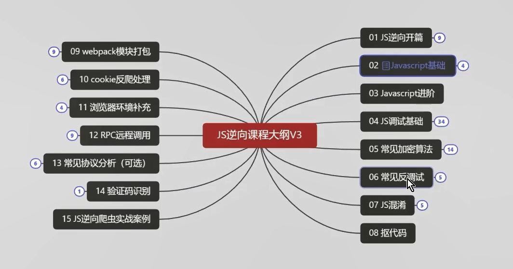
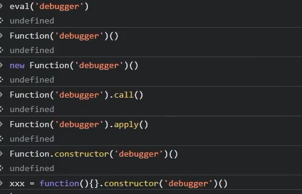
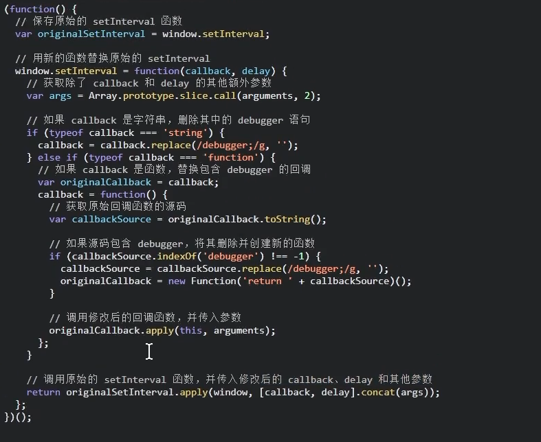
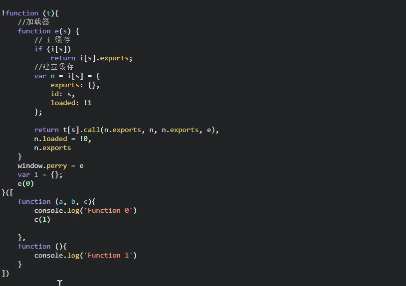

PyExecJS2:在python代码中可以调用js代码
```
import execjs

with open('test.js','r',encoding='utf-8') as f:
	js_code = f.read()

s = execjs.compile(js_code).call('get_sign')
```

## js基础

### 基础类型和引用类型

基础类型，在赋值时传递的是值本身

引用数据类型，则为地址

```
a = 1
b = a
b = 2  // a =1 ,b=2
```

```
a = {age:1}
b =a
b.age = 3   // a =b = {age:3}
```

### 闭包

函数内部的私有函数，外部无法访问

可以将内部函数赋值变量，提升为全局作用域，或直接返回

```
(function a(){
	function b(){
	
	}
	
	c = b
	or
	return b
})()
```

### 对象
```
function Teacher(name){
	this.name = name
	this.say = function(arg)
    {
		console.log('2')
    }
}

tom = new Teacher('tom')
jary = new Teacher('jary')
```
```
向原型对象添加方法
Teacher.prototype.sport = function(){

}


// 可以改变方法中的this指向，没有this则不起作用
tom.say.call(jary,'dd')
tom.say.apply(jary,['dd'])
```

eval(‘console.log(33)’)    #将字符串形式代码执行

## 寻找加密入口

### 搜索关键词和根栈调试

document一般使用搜索关键词

xhr一般使用根栈调试

### hook注入

利用Object.defineProperty(),监听值的变化，连接原函数的参数名和返回值，替换原函数的执行流程

1、手动注入

在第一个js文件的第一行打断点，或者：在在事件监听load事件打断点

在控制台注入

```
(function () {
	'use strict';
	var cookieTemp = '';
    Object.defineProperty(document,'cookie',{
        set:function(val){
        	if(val.indexOf('_dcf') != -1){
        		debugger
        	}
        	console.log('检测到cookie val')
        	cookieTemp = val
        },
        get:function(){
        	return cookieTemp
        }
    })
})

```

2、利用油猴脚本

编写自定义脚本，脚本会在网站自动运行

3、fiddler注入

注入时间更早

自运行函数，重写JSON.parse

```
(function(){
	var parse = JSON.parse
	JSON.parse = function(param){
		console.log('解析数据'，parse);
		debugger;
		return parse(param);
	}
})()
```

### 内存漫游

https://github.com/JSREI/ast-hook-for-js-RE下载漫游工具

npm i anyproxy

cd node_modules\\.bin，运行anyproxy ca,进行网站下载根证书（rootca）

双击安装证书，安装到受信任的机构颁发的证书

进入proxy_server文件夹，node proxy-server.js，启动服务器，

在浏览器上挂服务器代理，设置-更多工具-代理服务器

利用hook.search('加密值')查询

## 加密算法

MD5,sha,base64编码

### 对称加密，加密和解密使用同一个密钥

借助pycryptodome库，实现AES（16，32.。。。）,DES（8）,3DES

.rstrip('\0')

```
from Crypto.Cipher import AES
from Crypto.Util.Padding import pad , unpad  #填充
import base64

key = b'0123456789abcdefg'  #16字节
iv = b'0123456789abcdefg'


cipher = AES.new(key = key,mode = AES.MOOE_CBC ,iv = iv)

plain_text = '哈哈哈'.encode() # 转为字节

plain_text_pad = pad(plain_text,AES.block_size)

cipher_text = cipher.encrypt(plain_text_pad)   # 进行编码

cipher_text_base64 = base64.b64encode(cipher_text).decode()   # base64编码后方便传给前端
```

```
cipher_text_base64 = base64.b64decode(cipher_text)
cipher_text = cipher.decrypt(cipher_text_base64)  
plain_text_pad = unpad(cipher_text,AES.block_size)
plain_text = plain_text_pad.encode()
```


### 非对称加密，RSA，公钥和私钥

公钥加密，私钥解密

```
from Crypto.PublicKey import RSA

key = RSA.generate(2048)

private_key = key.export_key()
public_key = key.public_key().export_key()


plain_text = '哈哈哈'.encode() # 转为字节

key = RSA.import_key(public_key)
cipher = PKCS1_v1_5.new(key)
cipher_text = cipher.encrypt(plain_text)

cipher_text_base64 = base64.b64encode(cipher_text).decode()   # base64编码后方便传给前端
```

```
key = RSA.import_key(private_key)
cipher = PKCS1_v1_5.new(key)  # 填充方式

cipher_text = base64.b64decode(cipher_text_base64)
plain_text = cipher.dncrypt(cipher_text,None)  #None表示用PKCS1_v1_5填充
plain_text = plain_text_pad.encode()
```

## 反调试

### 无法打开控制台

```
监听快捷键，F12按下进行检测
window.close()
```

可以考虑fllder抓包

### 无限debugger



```
setInterval(() => {debugger;},1000)
```

```
eval('debugger')
```

不断生成随机函数名进行debugger,相当于不断执行新方法

debugger配合时间函数，关闭页面

利用hook,重写eval函数或者Function等等，code.include（‘debugger’）



### 控制台状态检测

- 格式化检测

格式化后会有'\\n'，行数会变多   

```js
const reg = new RegExp('\\n')
reg.test(a.toString())
```

去除判断，或者hook注入

- 浏览器内外高度差

````
window.outerWidth
window.innerWidth
````

- 检测时间差

  ```
  org=  Date.now()
  debugger
  current_time = Date.now()
  if(current_time- org) ....
  ```

- 不断清空控制台

  console.clear(),保留日志，preserve log开启

- 修改console.log()

  ```
  console.log = function(){}
  
  可以提前保存console.log副本
  ```

  

先解决格式化问题，在解决debugger问题

## js混淆

变量名混淆，起一些垃圾变量名，打断点利用浏览器自动解析

字符串混淆，利用ascil码对每个字符进行编码，同上处理

jsFuck,利用特殊字符对代码进行替换，hook注入evel函数

AAencode和JJ混淆，0oOliI相似进行混淆，破坏自运行函数，toString()查看函数进行打印或者利用hook

```
Function.prototype.constructor = function (a) {debugger;}
a   # a为要执行的加密前的代码
Function(a)()
```

代码逻辑混淆，代码平坦流，增加控制语句的流程，增加代码逻辑复杂度

## 扣代码

将核心的代码（加密...）复制到本地node.js，删除片段调试运行

## webpack

会多一份加载器



将加载器赋值为全局变量，window.perry = e

将初始化函数去除，e(0) 去除
