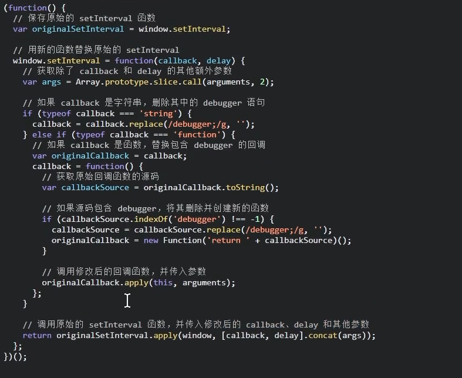
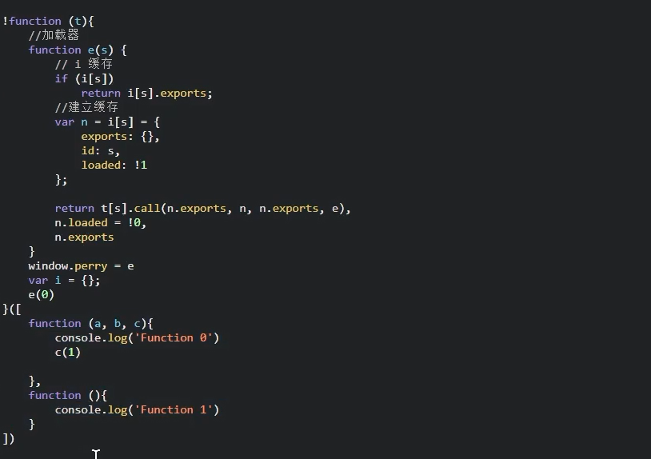

PyExecJS2:在python代码中可以调用js代码

```
import execjs

with open('test.js','r',encoding='utf-8') as f:
	js_code = f.read()

s = execjs.compile(js_code).call('get_sign')
```

## js基础

### 基础类型和引用类型

基础类型，在赋值时传递的是值本身

引用数据类型，则为地址

```
a = 1
b = a
b = 2  // a =1 ,b=2
```

```
a = {age:1}
b =a
b.age = 3   // a =b = {age:3}
```

### 函数

```
#构造函数方式
var a = new Function('n','m','console.log(n+m)')
a(1,2)

# 自运行函数
!function(){}();
```

### 闭包

函数内部的私有函数，外部无法访问

可以将内部函数赋值变量，提升为全局作用域，或直接返回

```
(function a(){
	function b(){
	
	}
	
	c = b
	or
	return b
})()
```

### 对象

```
function Teacher(name){
	this.name = name
	this.say = function(arg)
    {
		console.log('2')
    }
}

tom = new Teacher('tom')
jary = new Teacher('jary')
```

```
向原型对象添加方法
Teacher.prototype.sport = function(){

}


// 可以改变方法中的this指向，没有this则不起作用
tom.say.call(jary,'dd')
tom.say.apply(jary,['dd'])
```

eval(‘console.log(33)’)    #将字符串形式代码执行

## 寻找加密入口

常用搜：JSON.parse(

### 搜索关键词和根栈调试

document一般使用搜索关键词

xhr一般使用根栈调试

### hook注入

利用Object.defineProperty(),监听值的变化，连接原函数的参数名和返回值，替换原函数的执行流程

或是利用浏览器直接替换代码 

1、手动注入

在第一个js文件的第一行打断点，或者：在在事件监听load事件打断点

然后在控制台注入

```
# cookie 钩子
(function () {
	'use strict';
	var cookieTemp = '';
    Object.defineProperty(document,'cookie',{
        set:function(val){
        	if(val.indexOf('_dcf') != -1){
        		debugger
        	}
        	console.log('检测到cookie val')
        	cookieTemp = val
        },
        get:function(){
        	return cookieTemp
        }
    })
})（）

```


2、利用油猴脚本

编写自定义脚本，脚本会在网站自动运行

3、fiddler注入

注入时间更早

自运行函数，重写JSON.parse

```
(function(){
	var parse = JSON.parse
	JSON.parse = function(param){
		console.log('解析数据'，parse);
		debugger;
		return parse(param);
	}
})()
```

### 内存漫游

https://github.com/JSREI/ast-hook-for-js-RE下载漫游工具

npm i anyproxy

cd node_modules\\.bin，运行anyproxy ca,进行网站下载根证书（rootca）

双击安装证书，安装到受信任的机构颁发的证书

进入proxy_server文件夹，node proxy-server.js，启动服务器，

在浏览器上挂服务器代理，设置-更多工具-代理服务器

利用hook.search('加密值')查询

## 加密算法

单向加密：MD5(32位),sha256（64位，字母+数字）,base64编码

HMAC

### 对称加密，加密和解密使用同一个密钥

借助pycryptodome库，实现AES（16，32.。。。）,DES（8字节）,3DES

.rstrip('\0')去除填充


```
from Crypto.Cipher import AES
from Crypto.Util.Padding import pad , unpad  #填充
import base64

key = b'0123456789abcdefg'  #16字节
iv = b'0123456789abcdefg'


cipher = AES.new(key = key,mode = AES.MOOE_CBC ,iv = iv)

plain_text = '哈哈哈'.encode() # 转为字节

plain_text_pad = pad(plain_text,AES.block_size)

cipher_text = cipher.encrypt(plain_text_pad)   # 进行编码

cipher_text_base64 = base64.b64encode(cipher_text).decode()   # base64编码后方便传给前端
```

```
cipher_text_base64 = base64.b64decode(cipher_text)
cipher_text = cipher.decrypt(cipher_text_base64)  
plain_text_pad = unpad(cipher_text,AES.block_size)
plain_text = plain_text_pad.encode()
```

后端返回加密数据是对称加密

### 非对称加密，RSA，公钥和私钥

公钥加密，私钥解密

```
from Crypto.PublicKey import RSA

key = RSA.generate(2048)

private_key = key.export_key()
public_key = key.public_key().export_key()


plain_text = '哈哈哈'.encode() # 转为字节

key = RSA.import_key(public_key)
cipher = PKCS1_v1_5.new(key)
cipher_text = cipher.encrypt(plain_text)

cipher_text_base64 = base64.b64encode(cipher_text).decode()   # base64编码后方便传给前端
```

```
key = RSA.import_key(private_key)
cipher = PKCS1_v1_5.new(key)  # 填充方式

cipher_text = base64.b64decode(cipher_text_base64)
plain_text = cipher.dncrypt(cipher_text,None)  #None表示用PKCS1_v1_5填充
plain_text = plain_text_pad.encode()
```

## 反调试

### 无法打开控制台

```
监听快捷键，F12按下进行检测
window.close()
```

可以考虑fillder抓包

### 无限debugger


```
setInterval(() => {debugger;},1000)
```

```
eval('debugger')
```

不断生成随机函数名进行debugger,相当于不断执行新方法

debugger配合时间函数，关闭页面

利用hook,重写eval函数或者Function等等，code.include（‘debugger’）



过OB混淆debugger

```
Function.prototype.__constructor__back = Function.prototype.constructor

Function.prototype.constructor  = function(){
	if(arguments && typeof arguments[0] === 'string'){
		if ('debugger' === arguments[0]){
			return
		}
	}
}
```


### 控制台状态检测

- 格式化检测

格式化后会有'\\n'，行数会变多   

```js
const reg = new RegExp('\\n')
reg.test(a.toString())
```

去除判断，或者hook注入

- 浏览器内外高度差

````
window.outerWidth
window.innerWidth
````

- 检测时间差

  ```
  org=  Date.now()
  debugger
  current_time = Date.now()
  if(current_time- org) ....
  ```

- 不断清空控制台

  console.clear(),保留日志，preserve log开启

- 修改console.log()

  ```
  console.log = function(){}
  
  可以提前保存console.log副本
  ```

  

先解决格式化问题，在解决debugger问题

## js混淆

变量名混淆，起一些垃圾变量名，打断点利用浏览器自动解析

字符串混淆，利用ascil码对每个字符进行编码，同上处理

jsFuck,利用特殊字符对代码进行替换，hook注入evel函数

AAencode和JJ混淆，0oOliI相似进行混淆，破坏自运行函数，toString()查看函数进行打印或者利用hook

```
Function.prototype.constructor = function (a) {debugger;}
a   # a为要执行的加密前的代码
Function(a)()
```

代码逻辑混淆，代码平坦流，增加控制语句的流程，增加代码逻辑复杂度

## css偏移

将元素设置为display

或者调整偏移样式，123-》321

## 字体反爬虫

自定义字体文件，替换文字显示

@font-face{}

pip install fonttools   解析字体文件,建立字典

```
from fontTools.ttLib import TTFont
from io imoport BytesIO
import requests

def get_font():
	url = 'http://ee.woff'
	font_res = requests.get(url)
	data = BytesIO(font_res.content)
	font = TTFont(data)
	font.getBestCmap()  
```


## 扣代码

将核心的代码（加密...）复制到本地node.js，删除片段调试运行

## webpack

所有文件都是通过js渲染，会多一份加载器



e(0) 表示执行数组中第一个模块

将加载器赋值为全局变量，window.perry = e

然后将初始化函数去除，e(0) 去除，全复制webpack，再单独抽取加密函数

或者再导出器打断点，扣导出器中需要的webpack模块代码，补环境；

## cookie 反爬虫

服务器通过校验请求头中的cookie来区分正常用户和非正常用户


http-only打勾则为服务端返回，直接get页面地址即可获取

```
# cookie 钩子
(function () {
	'use strict';
	var cookieTemp = '';
    Object.defineProperty(document,'cookie',{
        set:function(val){
        	if(val.indexOf('_dcf') != -1){
        		debugger
        	}
        	console.log('检测到cookie val')
        	cookieTemp = val
        },
        get:function(){
        	return cookieTemp
        }
    })
})
```

 ## 补浏览器环境

在node.js中执行代码，有时需要补充web浏览器环境，缺失document的各种方法等

利用jsdom模拟足够的web浏览器子集

npm i jsdom

```
const jsdom = require("jsdom");
const { JSDOM } = jsdom;

const dom = new JSDOM(`<!DOCTYPE html><p>Hello world</p>`);
console.log(dom.window.document.querySelector("p").textContent); // "Hello world"

window = dom.window
document = window.document
navigator = window.navigator
var v = {}
```


```
#补充 atob解码
var atob = function(val){
	return Buffer.from(val,'base64').toString('binary')
}
var btoa = function(val){
	return Buffer.from(val).toString('base64')
}
```

## RPC 远程调用

服务端是浏览器，客户端是本地程序，两者通过websocket通信，暴露浏览器中的加密函数

浏览器不能关闭，维持进程开放，但不需要抠代码


jsrpc-goliang

sekiro-rpc：

1、下载压缩包https://oss.iinti.cn/sekiro/sekiro-demo

2、window执行bin/.bat文件开启服务

3、替换原代码，将加密入口挂载到window.xx上

或者直接将下面脚本插入到加密位置

4、在控制台或油猴注入以下脚本

```
function SekiroClient(e){if(this.wsURL=e,this.handlers={},this.socket={},!e)throw new Error("wsURL can not be empty!!");this.webSocketFactory=this.resolveWebSocketFactory(),this.connect()}SekiroClient.prototype.resolveWebSocketFactory=function(){if("object"==typeof window){var e=window.WebSocket?window.WebSocket:window.MozWebSocket;return function(o){function t(o){this.mSocket=new e(o)}return t.prototype.close=function(){this.mSocket.close()},t.prototype.onmessage=function(e){this.mSocket.onmessage=e},t.prototype.onopen=function(e){this.mSocket.onopen=e},t.prototype.onclose=function(e){this.mSocket.onclose=e},t.prototype.send=function(e){this.mSocket.send(e)},new t(o)}}if("object"==typeof weex)try{console.log("test webSocket for weex");var o=weex.requireModule("webSocket");return console.log("find webSocket for weex:"+o),function(e){try{o.close()}catch(e){}return o.WebSocket(e,""),o}}catch(e){console.log(e)}if("object"==typeof WebSocket)return function(o){return new e(o)};throw new Error("the js environment do not support websocket")},SekiroClient.prototype.connect=function(){console.log("sekiro: begin of connect to wsURL: "+this.wsURL);var e=this;try{this.socket=this.webSocketFactory(this.wsURL)}catch(o){return console.log("sekiro: create connection failed,reconnect after 2s:"+o),void setTimeout(function(){e.connect()},2e3)}this.socket.onmessage(function(o){e.handleSekiroRequest(o.data)}),this.socket.onopen(function(e){console.log("sekiro: open a sekiro client connection")}),this.socket.onclose(function(o){console.log("sekiro: disconnected ,reconnection after 2s"),setTimeout(function(){e.connect()},2e3)})},SekiroClient.prototype.handleSekiroRequest=function(e){console.log("receive sekiro request: "+e);var o=JSON.parse(e),t=o.__sekiro_seq__;if(o.action){var n=o.action;if(this.handlers[n]){var s=this.handlers[n],i=this;try{s(o,function(e){try{i.sendSuccess(t,e)}catch(e){i.sendFailed(t,"e:"+e)}},function(e){i.sendFailed(t,e)})}catch(e){console.log("error: "+e),i.sendFailed(t,":"+e)}}else this.sendFailed(t,"no action handler: "+n+" defined")}else this.sendFailed(t,"need request param {action}")},SekiroClient.prototype.sendSuccess=function(e,o){var t;if("string"==typeof o)try{t=JSON.parse(o)}catch(e){(t={}).data=o}else"object"==typeof o?t=o:(t={}).data=o;(Array.isArray(t)||"string"==typeof t)&&(t={data:t,code:0}),t.code?t.code=0:(t.status,t.status=0),t.__sekiro_seq__=e;var n=JSON.stringify(t);console.log("response :"+n),this.socket.send(n)},SekiroClient.prototype.sendFailed=function(e,o){"string"!=typeof o&&(o=JSON.stringify(o));var t={};t.message=o,t.status=-1,t.__sekiro_seq__=e;var n=JSON.stringify(t);console.log("sekiro: response :"+n),this.socket.send(n)},SekiroClient.prototype.registerAction=function(e,o){if("string"!=typeof e)throw new Error("an action must be string");if("function"!=typeof o)throw new Error("a handler must be function");return console.log("sekiro: register action: "+e),this.handlers[e]=o,this};


var client = new SekiroClient("ws://127.0.0.1:5612/business/register?group=test_web&clientId=" + Math.random());

client.registerAction("testAction", function (request, resolve, reject) {
	url = request['url']
	window.xx;
    resolve("ok");
});
```

5、成功访问该网址，即可获取resolve中的参数

```
http://127.0.0.1:5612/business/invoke?group=test_web&action=testAction&param=testparm
```

6.python 发送请求

 ```python
import requests

def get_sig():
    data = {
		'group':'test_web',
		'action':'testAction',
		'url':'sfsfsdf'	
    }	
    res = requests.post(url ='http://127.0.0.1:5612/business/invoke',data=data,verify=False)
    res = res.json()
    print(res)
    
get_sig()
 ```


 ## 验证码反爬虫

找图像处理模型

