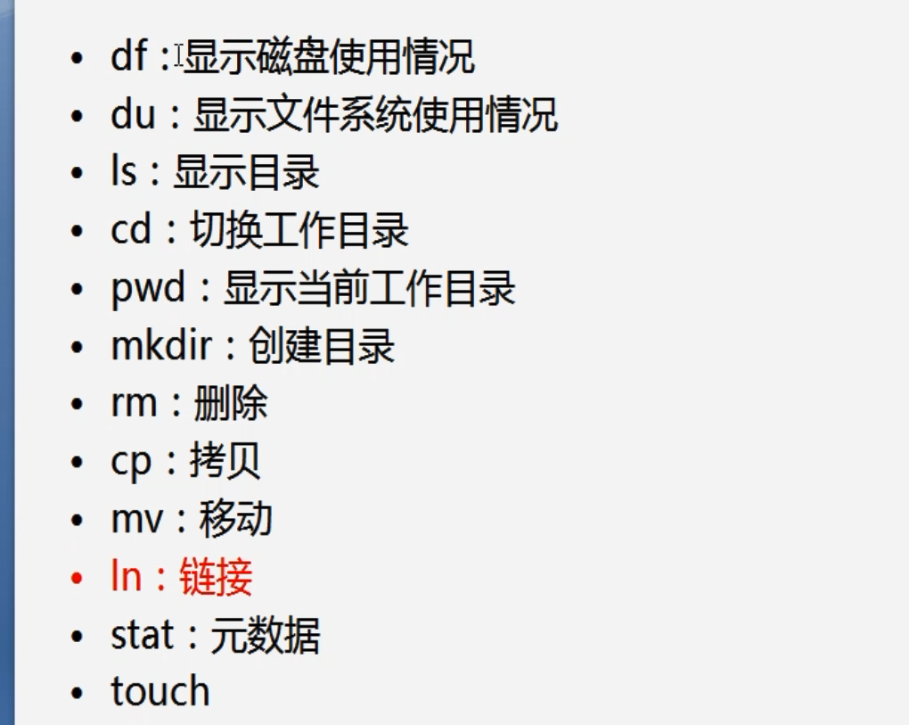
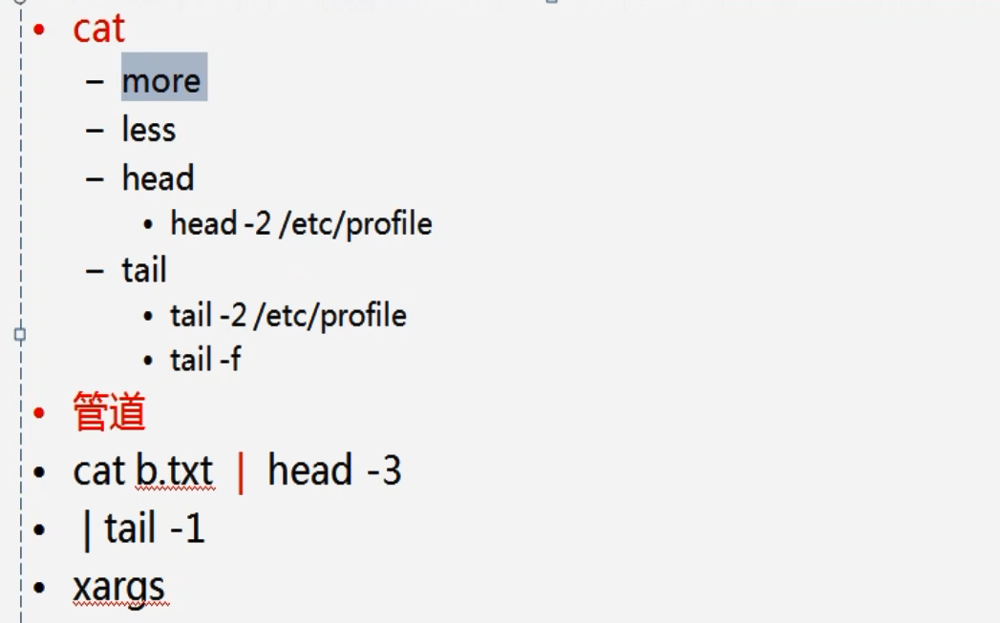
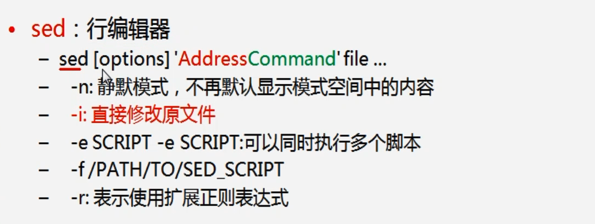

## 目录结构


## 常规命令

df -h            查看挂载点

mount /dev/a  /mnt            挂载



du -h  /etc   查看文件夹使用情况

ls  -a  查看包括隐藏文件
ls -l  长列表


man ls  查看ls命令详细参数  man + *

x/{a,b,c}dir   扩展符合，类似x/adir,x/bdir ..

rm -f a 删除文件a

rm -r a 删除文件夹a 

stat a  查看文件的属性，修改时间，创建时间等

torch  刷新文件信息或 创建文件



more a  分屏查看文件（不能回退）

管道|：左侧命令的输出作为右侧命令的输入

xargs:从标准输入流执行命令  echo '/' |xargs ls -a

## vim


hjkl 也可以移动光标

:set nu显示行号   


## 正则

grep "00cce" a.txt    输出包含00cce的行

## 文本处理


cut -d' ' -f1,2 a.txt  将分割后的第一列，第二列数据显示

排序：字典序-数值序

wc  a.txt  统计文章字符

### sed



 


sed -n '2d' a.txt 删除第二行

### awk


awk 必须使用单引号

echo $i | awk '{print $2}'

## 安装应用

### 编译安装  利用压缩包

### rpm 

利用已经编译好的软件包  rpm -ivh qqq.rpm

适用于独立包，不适合依赖多的包


### yum

基于rpm的包管理，会自动下载相关依赖

切换下载源，下载repo文件

yum clean all   #清除依赖关系

yum makecache

yum install mysql

当无法连接外网时，如何配置本地源：DVD

/etc/yum.repos.d/

改文件配置：


## bash

\# ! /bin/bash    启动子bash

source  aa.sh  执行

## 重定向

0标准输入

1标准输出

2错误输出

ls /root 1>aa  输出重定向到aa

\> >  追加重定向

ls  / /aa 1>aa 2>&1
ls / /aa 2>aa 1>aa
ls / /aa &> aa  == ls / /aa >& aa  == 1,2均输入到aa

## shell

a = 9

echo $a

bb(){

​	local a = 1  # 局部变量，只能用于函数

}

位置变量 $1,$2

source a.sh 4

a.sh : echo $1

echo $$ 查看当前进程号pid

echo $? 查看上条命令是否执行成功

文件执行时，不会继承父bash，需要export a,管道执行可以继承


a = 99

echo '$a' $a

echo "$a"   99

逻辑表达式：command1||command2,  $$ 

反引号，表示提前执行该命令


((a++)),需要赋值的时候，前面加$符号


### 编写脚本

root添加用户

```
#! /bin/bash
[! $# -eq 1] && echo "error" && exit 2
id $1 >$ /dev/null && echo "user existed" && exit 2
useradd $1 && echo $1 | passwd --stdin $1 >$ /dev/null && echo "useradd success" && exit 4
echo 'add error'
```

```
chmod +x addusr.sh
```

$# : 参数数量

if

while test $a -le 5; do echo $a; ((a++));done

for ((a=1,a<=5,a++));do echo $a;done

seq 5  # 1,2,3,4,5
