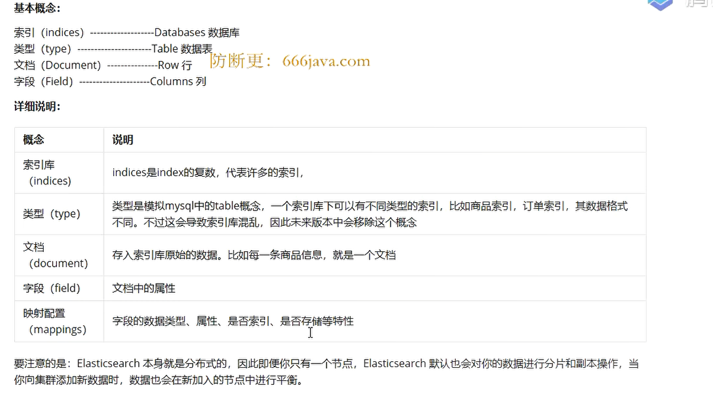

## json

```
data = {
	"name":"tom"
}
with open('data.json','w',encoding='utf-8') as f:
	f.write(json.dumps(data, indent=2,ensure_ascii=False)) #中文输出
```

## csv

```
import csv

with open('a.csv',w) as f:
	writer = csv.writer(f)
	
	# writer = csv.DictWriter(f,fieldnames=['name'])
	# writer.writeheader()
	
	writer.writerow(['hh'])
	writer.writerows([['hh'],['33']])
```

## xlsx

```
from openyxl import Workbook

wb = Workbook()

ws = wb.create_sheet('第一'，index=0)

ws.append('姓名')
ws.append(['tom'])

wb.save('xx.xlsx')
```

## mysql

```cmd
mysql -hlocalhost -uroot -p123456
```

```
import pymysql

db = pymysql.connect(host='localhost',user='root',passwd='123456',charset='utf8',port=3306)
#%%
cursor = db.cursor()

sql = "select version();"
cursor.execute(sql)

data = cursor.fetchone()
```

## mongodb

内容存储类型类似json

```
import pymongo

client = pymongo.MongoClient('localhost',27017)
db = client.db1
cursor = db.posts

result = cursor.insert_one({'title':'test','content':23})
```

## elasticsearch搜索引擎

是一个搜索服务器，提供分布式多用户的全文搜索

分布式的实时文件存储，每一个字段都可以被索引

实时分析的分布式搜索引擎

可扩展到上百台服务器，处理PB级结构化和非结构化数据



服务端：

https://artifacts.elastic.co/downloads/elasticsearch/elasticsearch-7.15.0-windows-x86_64.zip

双击/bin/elasticserch.bat

浏览器输入：http://127.0.0.1:9200/

客户端：

pip install elasticsearch==6.2.0

```
from elasticsearch import Elasticsearch
# 创建实例
es = Elasticsearch()
# 创建索引 http://127.0.0.1:9200/posts
res = es.indices.create(index='posts', ignore=400)
# res = es.indices.delete(index='posts')
# res = es.search(index='posts', body={})
res
```

