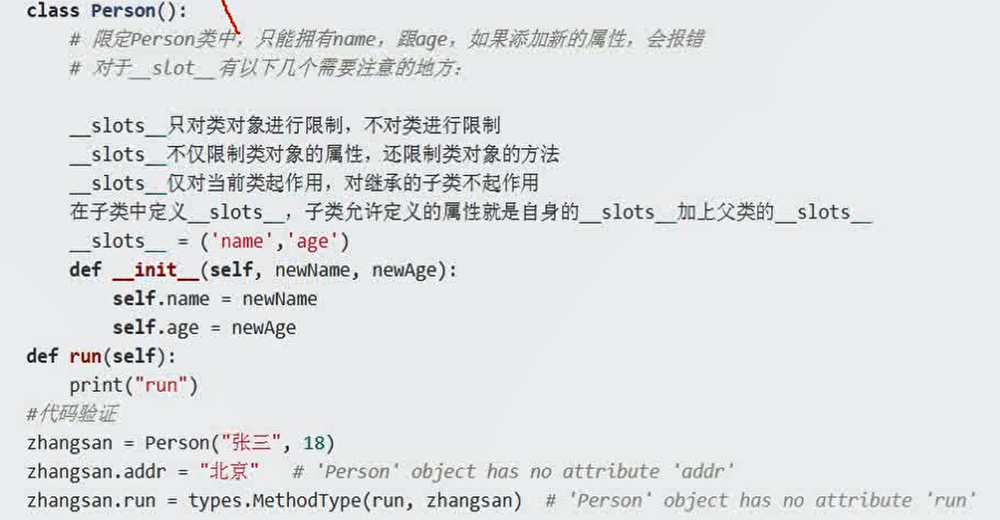
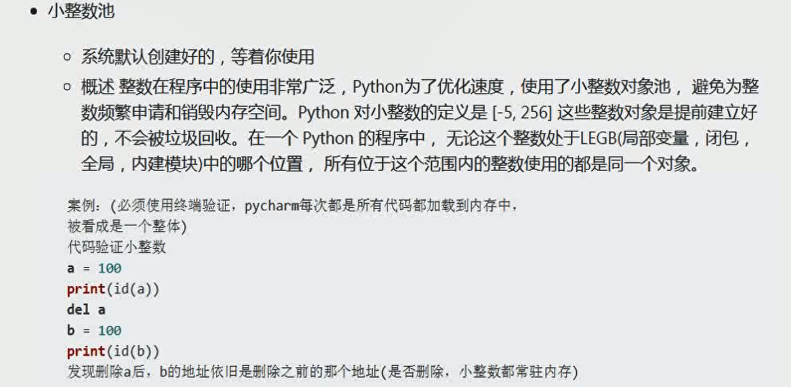
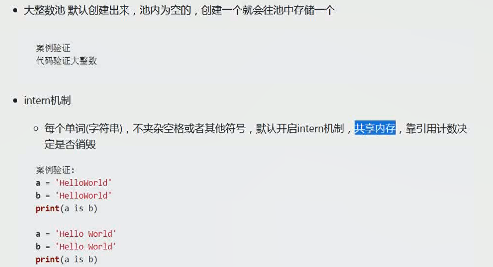
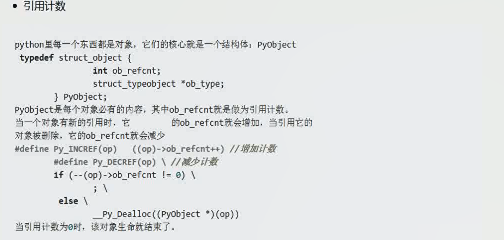
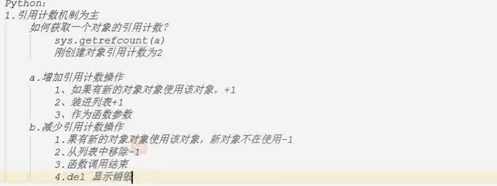

## 生成器gentertor

边循环，边计算的一种机制

节约空间和时间

````
list1 = (x for x in range(100))
for i in list1:
	print(i)
````

访问方式：
```
next(list1)

g.\__next__()

for i in list1

g.send(None)  # 第一次传参，必须是none，之后无要求
```

函数内加入 yield 也变成生成器

```
def test():
	for i in range(10):
		yield x
f = test()
next(f)
```


## 迭代器iterator

可迭代性iteratable

迭代器iterator,能被next，for访问，并不断返回下一个值

iter()可以将可迭代性元素变为迭代器，list，tuple,

## 闭包

本质就是一个函数

函数嵌套定义：内部函数和外部函数

内部函数使用外部函数的变量

外部函数返回内部函数名

```
def outer():
	a =1
	def inner():
		nonlocal a  # 函数内部想要修改外部变量，需要添加关键字
		a ++ 
		pass
	return inner
```

闭包的用途：

在可以不修改现有功能源码的情况下，增加新的功能

```
新增功能
def log(func)；
	pass

# 源代码
def func1():
	pass
	
def a(func):
	def b():
		log(func)  # 新增功能
		func()
	return b
	
func1 = a(func1) # 重新赋值
```


## 装饰器

同样在可以不修改现有功能源码的情况下，增加新的功能

```
def a(func):
    print(11)
    def b():
        print(1)
        func()
    return b

def a1(func):
    print(22)
    def b():
        print(2)
        func()
    return b

@a
@a1
def func1():
    pass

func1() # 22 11 1 2,多个装饰器，从里往外，再从外往里
```

通用装饰器

```
def a(func):
	def b(*args,**kwargs):
		return func(*args,**kwargs)
	return b
```

类装饰器

````
class AA():
	def __init__(self,func):
		self.__func__ = func
	def __call__(self,*args,**kwargs):
		self.other()
		self.__func__()
	def other(self):
		pass


@AA
def ff():
	pass
````


## 动态语言

在运行时，可以改变类的结构，增加，删除，修改方法属性

```
class Person():
	def __int__():
		pass

tom = Person()
tom.add = 33   #动态添加对象属性
setattr(p1,'gender','female')  # 动态添加对象属性   getattr(tom,'gender')
Person.aa =3  # 动态添加类属性
```

```
import types
def study(self):
	pass

tom.study = types.MethodType(study,tom)   # 将self绑定为person，添加对象方法


@staticmethod
def say():
	pass
Person.say = say   # 为类添加静态方法

@classmethod
def talk():
	pass
Person.talk = talk   # 为类添加类方法

```

### __slots__

对动态行为进行限制

\__slots__的作用：对类实例对象进行限制，对类属性，静态方法，类方法没有限制

Person.add = 3  # 可以正常



## 元类

可以动态创建类

type(类名，（父类...）,{属性，方法})

```
Person = type('Person',(),{})
p1 = Person()
```

## 对象池



其他的数被放在大整数池，不受全局唯一性控制



下划线不属于特殊符号

## 垃圾回收机制GC

python采用引用计数为主，标记清除和隔代收集两种机制为辅的策略





缺点：维护引用技术消耗资源，循环引用的问题无法解决

隔代回收为了解决循环引用问题。

有三代，每代的阈值不同，当冗余对象达到阈值时，触发隔代回收，清除无用对象

## functools

### 偏函数

用于固定函数属性的函数,底层是闭包实现

```
from functools import pratial

int2 = partial(int,base=2)
int2('1001')
```

### warps

可以将原函数对象的指定属性复制给包装函数对象，默认的有module，name,doc或者通过参数选择

```
from functools import warps

def out(func):
	@warps(func)
	def in(*args,**kwargs):
		return func(*args,**kwargs)
	return in

@out
def a():
	pass
	
test = a()
test.__name__  #此时是a,而不是in，保留原始属性
test.__doc__
```


### reduce

累计操作

```
from functools import reduce

reduce(lambda x,y:x+y,[1,3,5],0)
```

## 高级内置函数

```
map(lambda x:x**2,[1,2,3,3])      #返回迭代器
filter(lambda x: x>1,[1,2,-1,3])  #返回迭代器
sorted([1,2,4,-2]，key=lambda x:(x<0,abs(x)))    #list.sort()对原数据进行排序，sorted对备份数据进行排序
```

